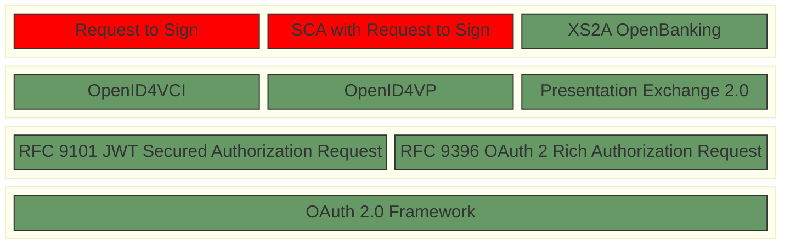

# Strong-customer-authentication for the European Digital Identity Wallet
This repository contains a proposal on how the base protocols for the European Digital Identity Wallet (EUDIW) proposed by the [Architecture Reference Framework](https://github.com/eu-digital-identity-wallet/eudi-doc-architecture-and-reference-framework) of the European Commission might be used to perform strong-customer-authentication (SCA) for payments in the sense of the EU Revised Directive on Payment Services (PSD2).

> [!NOTE]
> DISCLAIMER: This publication is work-in-progress and will be progressively updated.

## Baseline Architecture proposed by the ARF

## Buildingblocks

## SCA and Payments using OpenID4VP

This paper describes how OpenID4VP might be used to perform SCA including dynamic linking according to the PSD2.

- [SCA based on OpenID4VP using OpenBanking](openbanking-r2s.md)

