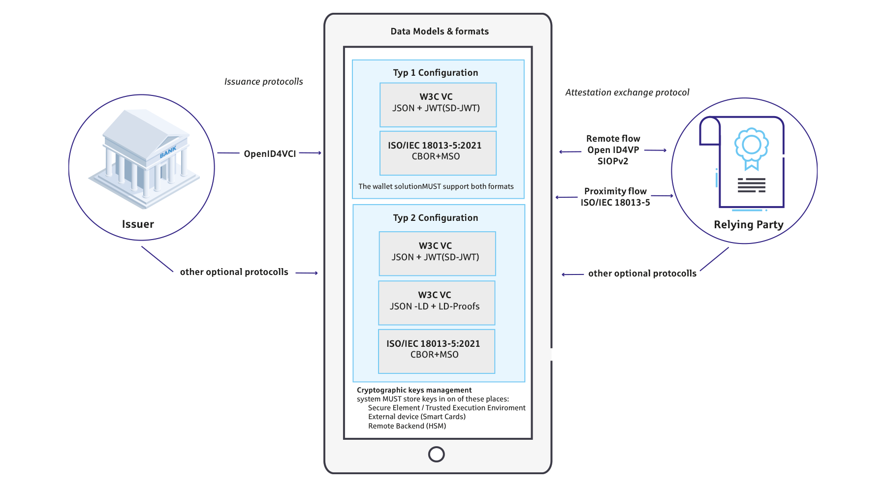
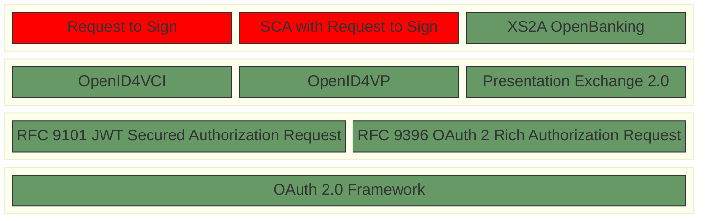

# Strong-customer-authentication for the European Digital Identity Wallet
This repository contains papers and concepts on how the base protocols for the European Digital Identity Wallet (EUDIW) might be used to perform strong-customer-authentication (SCA) in the sense of the EU Revised Directive on Payment Services (PSD2).

> [!NOTE]
> DISCLAIMER: This publication is work-in-progress and will be progressively updated.

## Request to Sign

This paper describes a generic approach on how a verifier might request a wallet to sign dynamic transaction related data.  
- [Request to sign based on OpenID4VP](openid4vp-r2s.md)

## SCA with Request to Sign

This paper describes how the mechanics of the [Request to sign](openid4vp-r2s.md) might be used to perform SCA within a banking context.

- [SCA based on OpenID4VP using OpenBanking](openbanking-r2s.md)

