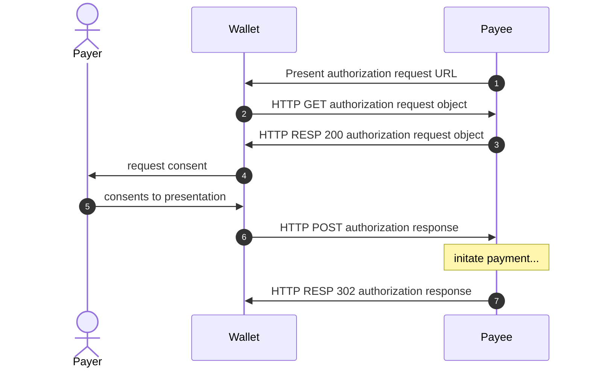
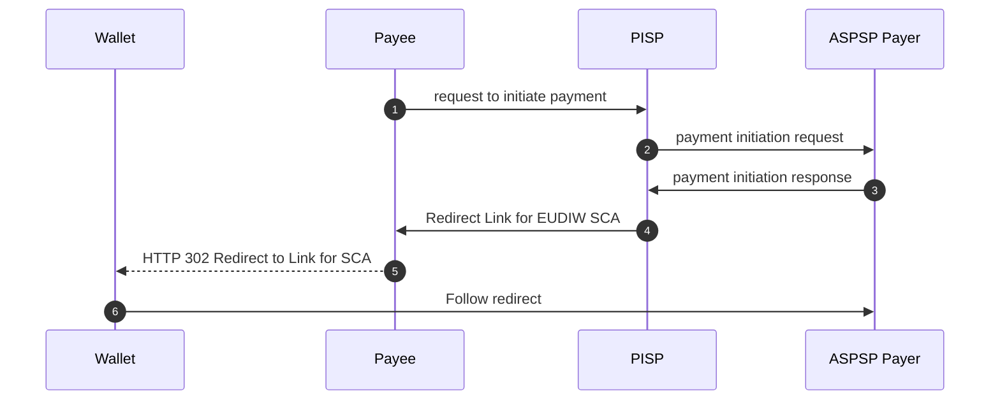
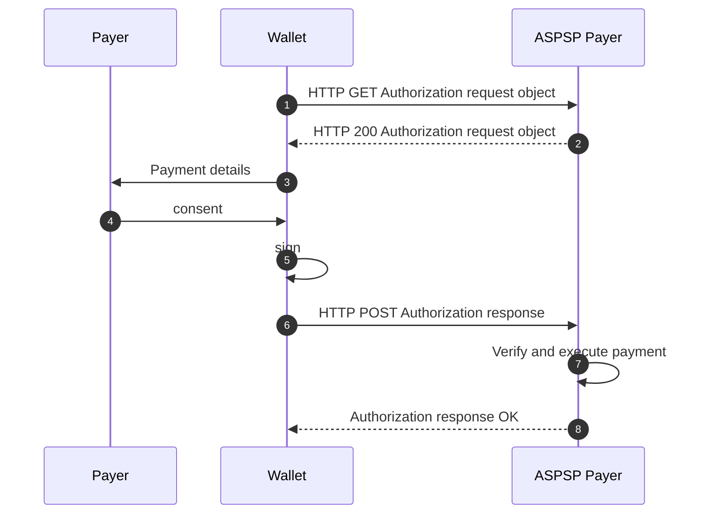

# SCA based on OpenID4VP using OpenBanking

## Abstract
Open banking is a financial concept allowing third-party financial service providers to access customer banking data through APIs (Application Programming Interfaces). This innovation enables customers to securely authorize payment or share their financial information with other financial institutions or third-party providers. 

Strong Customer Authentication (SCA) is a crucial requirement under the Revised Payment Service Directive (PSD2) aimed at enhancing the security of electronic payments. To meet SCA standards in open banking, banks must implement multi-factor authentication, typically involving two out of three factors: 

- knowledge (e.g., password or PIN)
- possession (e.g., mobile phone)
- and inherence (e.g., biometrics like fingerprint or facial recognition). 

This additional layer of security is essential to combat fraud in online transactions and protect both financial institutions and consumers. Today there exist multiple ways on how SCA can be performed. 

- **Redirected**: The Redirected SCA approach described in XS2A section 5.1.1[^xs2a] involves redirecting users to their bank's authentication interface during a payment transaction to complete the authorization process. This method presents a pre-populated credit transfer screen for the user's confirmation, making it a semi-automated process where the flow is controlled by the user, initiating the payment themselves Embedded
- **Embedded**: The Embedded SCA approach described in XS2A section 5.1.8[^xs2a] involves a fully automated process where the payment is initiated on behalf of the Payment Service User (PSU) by the Third-Party Provider (TPP). In this method, the user shares their credentials with the TPP, who then authenticates and initiates the payment in the background, embedding the authentication process seamlessly within the transaction flow.
- **Decoupled**: The Decoupled approach described in XS2A section 5.1.7[^xs2a] offers a convenient method to obtain SCA approval with minimal effort from the merchant or cardholder. This approach allows transactions to occur without the cardholder being actively engaged with the merchant's website or mobile application. Instead, authentication is conducted through alternative channels, such as mobile push notifications within banking apps, email, or other methods chosen by the Issuer bank to inform the cardholder of an authentication request from a merchant.


Dynamic linking is another key requirement under the Strong Customer Authentication (SCA) rules of the PSD2 for remote electronic payment transactions. It aims to ensure the integrity of the transaction by cryptographically linking the payment details to the customer's authentication. Here's how it works:

Dynamic linking requires at least two elements to be used for SCA compliance:

1. An authentication code or cryptogram that is uniquely linked to the specific payment amount and payee account. This is typically generated using the customer's authentication factors (e.g. biometrics, PIN, etc.)

2. The payment details themselves, including the amount and payee account details.

These two elements must be dynamically presented to the customer during authentication, ensuring they are verifying the actual payment details. The authentication code cryptographically binds the customer's identity to those payment specifics.

This prevents man-in-the-middle attacks where payment details could be modified after authentication. It also stops replay attacks reusing authentication codes across multiple transactions.

The dynamic linking process varies by authentication method, but often involves the customer's mobile app displaying the payment amount and merchant details alongside the authentication prompt. The authentication response then includes a cryptogram calculated over those payment details, dynamically linking them.

Article 5(1) of the Delegated Regulation (EU) 2018/389 states that: Where payment service providers apply strong customer authentication in accordance with Article 97(2) of Directive (EU) 2015/2366, in addition to the requirements of Article 4, they shall adopt security measures that meet each of the following requirements: 
1. the payer is made aware of the amount of the payment transaction and of the payee; 
2. the authentication code generated is specific to the amount of the payment transaction and the payee agreed to by the payer when initiating the transaction; 
3. the authentication code accepted by the payment service provider corresponds to the original specific amount of the payment transaction and to the identity of the payee agreed to by the payer; 
4. any change to the amount or the payee results in the invalidation of the authentication code generated.

In summary, dynamic linking is crucial for ensuring SCA provides true transaction integrity and non-repudiation under PSD2's remote electronic payment rules.

This document is focussing on the option to leverage the OpenID4VP[^openid4vp] and OpenID4VCi[^openid4vci] specifications in order to introduce a standardized approach to allow compatible wallet applications to act as an authentication mean for SCA and payments . 


## Terminology

- **ASPSP**: Account Serving Payment Service Provider 
- **Wallet**: An entity that receives, stores, presents, and manages credentials and key material of the End User. A wallet is defined as a nativ mobile application.
- **Payment credential** : A verifiable credential issued by an ASPSP to a customer. The credential must be cryptographically bound to a private key residing in the wallet.
- **Decentralized Identifier**: An identifier with its core ability being enabling Clients to obtain key material and other metadata by reference, defined in DID Core [^did].


## Flow

Brief description of a payment initation flow using a payment initiation service (PIS) described in XS2A section 5[^xs2a]. Note: Besides payment initiation, the flow can also be used to authorize other kind of transaction like logging into online banking e.g.. 

### Onboarding

Prior to using a wallet as a mean for SCA, it requires an onboarding to exchange a cryptographic key-set between the ASPSP and a customer wallet. The exchange is done by the ASPSP issuing a payment credential using OpenID4VCI [^openid4vci]. The private key will be created exclusivly for the presentation of the payment credential as also required by the European Commisions Architecture Reference Framework in section 6.3.2.4[^arf] stating that *"for each attestation, the EUDI Wallet Instance has access to an attestation private key, which is stored in the WSCD in (or connected to) the User’s device"*. The private key provides one of the authentication factors (possesion) for SCA. The access to the private always needs to be protected by the wallet using a second factor being either a PIN (knowledge) or biometrics (inherence).

#### Payment Credential

The payment credential MUST be cryptographically bound to a dedicated private key created by the wallet and used to sign a `proof` while requesting the issuing of a Payment credential as described in OpenID4VCi, section 7.2[^openid4vci]. The `proof` parameter is therefor always REQUIRED.

The `credentialSubject` includes the following properties:

- `id`: REQUIRED. Unique ID of the credential
- `aspsp_name`: RECOMMENDED. Name of the issuing ASPSP.
- `account_alias`: REQUIRED.
- `bic`: REQUIRED. Business Identifier Code of the Bank.

> [!NOTE]
> Depending on the actual payment rail, the payment credential might include other / additional properties.


Example of an issued Payment credential.

```json
{
  "iss": "did:jwk:eyJjcnYiOiJQLi...",
  "jti": "dc961165-fb13-4d19-98f0-37c9bb06be",
  "nbf": 1707232027,
  "aud": "EUDIW",
  "nonce": "a2bcc3e0-623d-441d-aa80-31d82aa665d1",
  "sub": "did:jwk:eyJrdHkiOiJFi...",
  "vc": {
    "@context": [
      "https://www.w3.org/2018/credentials/v1",
      "https://w3id.org/security/suites/jws-2020/v1"
    ],
    "type": [
      "VerifiableCredential",
      "PaymentKey"
    ],
    "credentialSubject": {
      "id" : "s4dft5f",
      "aspsp_name": "Super Bank",
      "account_alias": "MyAccount",
      "bic": "DEUTDEFFXXX"
    }
  }
}

```

### Payment

#### Screenflow

Same-device screenflow of the payment process:


1. Merchant app initiates the process by requesting the presentation of a payment credential.
2. Redirect to wallet. Wallet asking the payer to consent to the presentation of a payment credential. If more than one suitable payment credential is available, they have to choose one. 
    - Consent might include biometrics or PIN.
3. Wallet displays the payment details and asks for content to the presentation.
    - Consent must include biometrics or PIN.
4. Purchase is completed.

#### Present payment credential



1. The payee requests the presentation of a Payment credential as defined by OpenID4VP[^openid4vp]. The authorization request URL is tranmitted
    - **cross-device** by presenting it as a QR code / NFC Tag or
    - **same-device** by activating a link with a custom URL scheme.
2. `HTTP GET` to load the OpenID4VP authorization request object
3. `HTTP GET 200` response including the OpenID4VP authorization request object. The included `presentation_definition` requests the presentation of a valid payment credential from the wallet.
4. Wallet request consents to present the payment credential from the payer.
5. Payer consents to the presentation.
6. `HTTP POST` OpenID4VP authorization response using `response_mode=direct_post`. The response includes a verifiable presentation of a payment credential. This will trigger the initation of a payment.
    Note over payee: initate payment... 
7. `HTTP POST` 302 Redirect to SCA

#### Payment initiation



1. Once the payee verified the presented payment credential, it initiates a payment using a payment initiation service provider (PISP). The presented Payment credential must be send along with the payment details.
2. The PISP uses the information included in the payment credential to initiate a payment at the payers ASPSP (aka the issuer of the payment credential) utilizing an OpenBanking API payment initiation request.
3. In response, the ASPSP of the payer sends the link to authorize the payment to the PISP.
4. The PISP forwards the authorization link to the merchant.
5. `HTTP 302` The payee redirects the wallet to the SCA authorization link as response to the presentation of the payment credential using `response_mode=direct_post`. As an alternative the merchant may display the link that has to be activated by the user.
6. The wallet follows the authorization link to initiate the SCA.


#### SCA payment authorization




1. `HTTP GET` to load the OpenID4VP authorization request for the SCA 
2. `HTTP 200` response including the OpenID4VP authorization request, which must contain
    - `nonce` value calculated by hashing the transaction details as described [here](#dynamic-authentication-code) and
    - the `presentation_definition` requesting the presentation of the payment credential. The `input_descriptor` MUST include the `purpose` property, which contains the details of the payment like amount and payee. 
3. The wallet presents the `purpose` of the presentation request to the payer informing him about the amount, currency and the payee of the transaction.
4. The user consents to the presentation of the payment credential by providing the **first factor like a wallet PIN or biometrics**.
5. The wallet creates a payment credential presentation **signed with the private key created during the onboard as a second factor** and linked dynamically to the transaction by including the `nonce` value as described in OpenID4VP section 12.1 [^openid4vp].
6. `HTTP POST` including the OpenID4VP authorization response and the verifiable presentation of the payment credential.
7. The ASPSP verifies the verfiable presentation of the payment credential using the public key of the payer and executes the payment.
8. `HTTP 200`  signals the wallet that the verifiable presentation has been received and verified successfully. Depending on the payment rail, it might also indicate the successful execution of a payment.

Example of a complete authorization request object:

```json
{
  "aud": "EUDIW",
  "client_id": "did:jwk:eyJrdHkiOiJFQ...",
  "client_id_scheme": "did",
  "iss": "did:jwk:eyJrdHkiOiJFQ...",
  "nonce": "e346bf0f693f21c3d66785970104419671004e77b08195186dec96d3476eb25f",
  "presentation_definition": {
    "id": "32f54163-7166-48f1-93d8-ff217bdb0653",
    "input_descriptors": [
            {
              "id": "subject",
              "purpose": "Authorize the payment of 123,49 Euro to Merchant A, IBAN DE88940594210020801890 at 2024-03-21T09:46:14 - transaction id 123456",
              "path": [
                "$.sub"
              ],
              "filter": {
                "type": "string",
                "const": "did:example:sd5sde"
              }
            }
          ]
        }
      }
    ]
  },
  "response_mode": "direct_post",
  "response_type": "vp_token",
  "response_uri": "https://bank.com/verifier/present",
  "state": "DUcDuyi8efXwAsB6"
}

```


#### Payment Status


1. The PISP polls the status of the payment using OpenBanking APIs. Alternativly this might also be done using a dedicated callback if offered by the ASPSP.
2. The ASPSP communicates the status of the payment to the PISP.
3. The PISP communicates the status of the payment to the payee.
4. The PISP communicates the status of the payment to the payer.

## Dynamic Authentication Code

The requirements of the PSD2 regarding the dynamic linking of the SCA to a specific payment transaction can be fulfilled by utilizing the `nonce` property of the authorization request. There are multiple options on doing this, however the basic priciple would be to generate a hash using the actual payment details contained in the `purpose` field. This way, the wallet could be able to verify that the displayed purpose text correlates to the nonce value.

```bash
> authorization_code="Authorize the payment of 123,49 Euro to Merchant A, IBAN DE88940594210020801890 at 2024-03-21T09:46:14 - transaction id 123456"
> echo $authorization_code | sha256sum
e346bf0f693f21c3d66785970104419671004e77b08195186dec96d3476eb25f
```


[^xs2a]: [NextGenPSD2 XS2A Framework Implementation Guidelines](https://www.berlin-group.org/_files/ugd/c2914b_fec1852ec9c640568f5c0b420acf67d2.pdf)
[^openid4vp]: [OpenID4VP - draft 20](https://openid.net/specs/openid-4-verifiable-presentations-1_0.html)
[^openid4vci]: [OpenID4VCI - draft 13](https://openid.net/specs/openid-4-verifiable-credential-issuance-1_0.html)
[^did]:[Decentralized Identifiers - DIDs v1.0](https://www.w3.org/TR/did-core/)
[^arf]:[Architecture Reference Framework 1.3](https://github.com/eu-digital-identity-wallet/eudi-doc-architecture-and-reference-framework/releases/download/v1.3.0/ARF-v1.3.0-for-publication.pdf)
