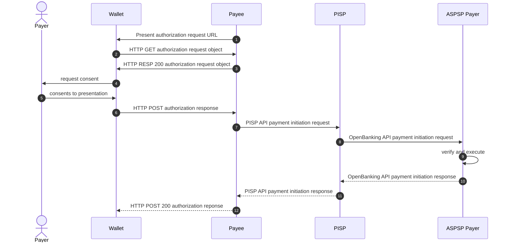

# SCA based on OpenID4VP using OpenBanking

## Abstract
Open banking is a financial concept allowing third-party financial service providers to access customer banking data through APIs (Application Programming Interfaces). This innovation enables customers to securely authorize payment or share their financial information with other financial institutions or third-party providers. 

Strong Customer Authentication (SCA) is a crucial requirement under the Revised Payment Service Directive (PSD2) aimed at enhancing the security of electronic payments. To meet SCA standards in open banking, banks must implement multi-factor authentication, typically involving two out of three factors: 

- knowledge (e.g., password or PIN)
- possession (e.g., mobile phone)
- and inherence (e.g., biometrics like fingerprint or facial recognition). 

This additional layer of security is essential to combat fraud in online transactions and protect both financial institutions and consumers. Today there exist multiple ways on how SCA can be performed. 

- **Redirected**: The Redirected SCA approach described in XS2A section 5.1.1[^xs2a] involves redirecting users to their bank's authentication interface during a payment transaction to complete the authorization process. This method presents a pre-populated credit transfer screen for the user's confirmation, making it a semi-automated process where the flow is controlled by the user, initiating the payment themselves Embedded
- **Embedded**: The Embedded SCA approach described in XS2A section 5.1.8[^xs2a] involves a fully automated process where the payment is initiated on behalf of the Payment Service User (PSU) by the Third-Party Provider (TPP). In this method, the user shares their credentials with the TPP, who then authenticates and initiates the payment in the background, embedding the authentication process seamlessly within the transaction flow.
- **Decoupled**: The Decoupled approach described in XS2A section 5.1.7[^xs2a] offers a convenient method to obtain SCA approval with minimal effort from the merchant or cardholder. This approach allows transactions to occur without the cardholder being actively engaged with the merchant's website or mobile application. Instead, authentication is conducted through alternative channels, such as mobile push notifications within banking apps, email, or other methods chosen by the Issuer bank to inform the cardholder of an authentication request from a merchant.


Dynamic linking is another key requirement under the Strong Customer Authentication (SCA) rules of the PSD2 for remote electronic payment transactions. It aims to ensure the integrity of the transaction by cryptographically linking the payment details to the customer's authentication. Here's how it works:

Dynamic linking requires at least two elements to be used for SCA compliance:

1. An authentication code or cryptogram that is uniquely linked to the specific payment amount and payee account. This is typically generated using the customer's authentication factors (e.g. biometrics, PIN, etc.)

2. The payment details themselves, including the amount and payee account details.

These two elements must be dynamically presented to the customer during authentication, ensuring they are verifying the actual payment details. The authentication code cryptographically binds the customer's identity to those payment specifics.

This prevents man-in-the-middle attacks where payment details could be modified after authentication. It also stops replay attacks reusing authentication codes across multiple transactions.

The dynamic linking process varies by authentication method, but often involves the customer's mobile app displaying the payment amount and merchant details alongside the authentication prompt. The authentication response then includes a cryptogram calculated over those payment details, dynamically linking them.

Article 5(1) of the Delegated Regulation (EU) 2018/389 states that: Where payment service providers apply strong customer authentication in accordance with Article 97(2) of Directive (EU) 2015/2366, in addition to the requirements of Article 4, they shall adopt security measures that meet each of the following requirements: 
1. the payer is made aware of the amount of the payment transaction and of the payee; 
2. the authentication code generated is specific to the amount of the payment transaction and the payee agreed to by the payer when initiating the transaction; 
3. the authentication code accepted by the payment service provider corresponds to the original specific amount of the payment transaction and to the identity of the payee agreed to by the payer; 
4. any change to the amount or the payee results in the invalidation of the authentication code generated.

In summary, dynamic linking is crucial for ensuring SCA provides true transaction integrity and non-repudiation under PSD2's remote electronic payment rules.

This document is focussing on the option to leverage the OpenID4VP[^openid4vp] and OpenID4VCi[^openid4vci] specifications in order to introduce a standardized approach to allow compatible wallet applications to act as an authentication mean for SCA and payments . 


## Terminology

- **ASPSP**: Account Serving Payment Service Provider 
- **Wallet**: An entity that receives, stores, presents, and manages credentials and key material of the End User. A wallet is defined as a nativ mobile application.
- **Payment credential** : A verifiable credential issued by an ASPSP to a customer. The credential must be cryptographically bound to a private key residing in the wallet.


## Flow

Brief description of a payment initation flow using a payment initiation service (PIS) described in XS2A section 5[^xs2a]. Note: Besides payment initiation, the flow can also be used to authorize other kind of transaction like logging into online banking e.g.. 

### Onboarding

Prior to using a wallet as a mean for SCA, it requires an onboarding to exchange a cryptographic key-set between the ASPSP and a customer wallet. The exchange is done by the ASPSP issuing a payment credential using OpenID4VCI [^openid4vci]. The private key will be created exclusivly for the presentation of the payment credential as also required by the European Commisions Architecture Reference Framework in section 6.3.2.4[^arf] stating that *"for each attestation, the EUDI Wallet Instance has access to an attestation private key, which is stored in the WSCD in (or connected to) the User’s device"*. The private key provides one of the authentication factors (possesion) for SCA. The access to the private always needs to be protected by the wallet using a second factor being either a PIN (knowledge) or biometrics (inherence). In order to ensure that the wallet is able to protect the private key according to given regulations, the ASPSP must rely on a proper client authentication as described in OpenID4VCI [^openid4vci] section 12.5.

#### Payment Credential

The payment credential MUST be cryptographically bound to a dedicated private key created by the wallet and used to sign a `proof` while requesting the issuing of a Payment credential as described in OpenID4VCi, section 7.2[^openid4vci]. The `proof` parameter is therefor always REQUIRED.

The `credentialSubject` includes the following properties:

- `id`: REQUIRED. Unique ID of the credential
- `aspsp_name`: RECOMMENDED. Name of the issuing ASPSP.
- `account_alias`: REQUIRED.
- `bic`: REQUIRED. Business Identifier Code of the Bank.

> [!NOTE]
> Depending on the actual payment rail, the payment credential might include other / additional properties.


Example of an issued Payment credential.

JWT

```
eyJraWQiOiJkaWQ6andrOmV5SnJkSGtpT2lKUFMxQWlMQ0oxYzJVaU9pSnphV2NpTENKamNuWWlPaUpGWkRJMU5URTVJaXdpYTJsa0lqb2laRGRqTkRJNFlqTmlabU0zTkdOa09UbG1NRE01T1dFMFpUQTJZamhrTVdRaUxDSjRJam9pVEVSeWRYZ3liRmhFTkZSRVgxQk1Na1EyVUd4UlgzUk5kV3cxY2pOMVJsRjFRVFI2UldwblRqUjRRU0lzSW1Gc1p5STZJa1ZrUkZOQkluMCMwIiwidHlwIjoiSldUIiwiYWxnIjoiRWREU0EifQ.eyJpc3MiOiJkaWQ6andrOmV5SnJkSGtpT2lKUFMxQWlMQ0oxYzJVaU9pSnphV2NpTENKamNuWWlPaUpGWkRJMU5URTVJaXdpYTJsa0lqb2laRGRqTkRJNFlqTmlabU0zTkdOa09UbG1NRE01T1dFMFpUQTJZamhrTVdRaUxDSjRJam9pVEVSeWRYZ3liRmhFTkZSRVgxQk1Na1EyVUd4UlgzUk5kV3cxY2pOMVJsRjFRVFI2UldwblRqUjRRU0lzSW1Gc1p5STZJa1ZrUkZOQkluMCIsInN1YiI6ImRpZDpqd2s6ZXlKcmRIa2lPaUpQUzFBaUxDSjFjMlVpT2lKemFXY2lMQ0pqY25ZaU9pSkZaREkxTlRFNUlpd2lhMmxrSWpvaVkyUXpaREpsWkRVMU5qZGtOREl6Tm1Gak5HVTVORE5tWldVME5tUXpORGdpTENKNElqb2lNVGcxUm1SYWFERkhkVGhrVWxKZmNuZGhNV1J5Tm14YWRETXRTRFJDWkRSdVV6WmFTMU56UlZVeGF5SXNJbUZzWnlJNklrVmtSRk5CSW4wIiwibmJmIjoxNzE4MTk4NDMzLCJpYXQiOjE3MTgxOTg0MzMsInZjIjp7InR5cGUiOlsiVmVyaWZpYWJsZUNyZWRlbnRpYWwiLCJQYXltZW50S2V5Il0sIkBjb250ZXh0IjpbImh0dHBzOi8vd3d3LnczLm9yZy8yMDE4L2NyZWRlbnRpYWxzL3YxIiwiaHR0cHM6Ly93d3cudzMub3JnLzIwMTgvY3JlZGVudGlhbHMvZXhhbXBsZXMvdjEiXSwiaWQiOiJ1cm46dXVpZDpmZmQ2YWQxYi0xYTEyLTQwYzQtYjRhMi0zNTQwMzM4YjViZGYiLCJpc3N1ZXIiOnsiaWQiOiJkaWQ6andrOmV5SnJkSGtpT2lKUFMxQWlMQ0oxYzJVaU9pSnphV2NpTENKamNuWWlPaUpGWkRJMU5URTVJaXdpYTJsa0lqb2laRGRqTkRJNFlqTmlabU0zTkdOa09UbG1NRE01T1dFMFpUQTJZamhrTVdRaUxDSjRJam9pVEVSeWRYZ3liRmhFTkZSRVgxQk1Na1EyVUd4UlgzUk5kV3cxY2pOMVJsRjFRVFI2UldwblRqUjRRU0lzSW1Gc1p5STZJa1ZrUkZOQkluMCJ9LCJpc3N1YW5jZURhdGUiOiIyMDI0LTA2LTEyVDEzOjIwOjMzWiIsImlzc3VlZCI6IjIwMjQtMDYtMTJUMTM6MjA6MzNaIiwidmFsaWRGcm9tIjoiMjAyNC0wNi0xMlQxMzoyMDozM1oiLCJjcmVkZW50aWFsU3ViamVjdCI6eyJpZCI6ImRpZDpqd2s6ZXlKcmRIa2lPaUpQUzFBaUxDSjFjMlVpT2lKemFXY2lMQ0pqY25ZaU9pSkZaREkxTlRFNUlpd2lhMmxrSWpvaVkyUXpaREpsWkRVMU5qZGtOREl6Tm1Gak5HVTVORE5tWldVME5tUXpORGdpTENKNElqb2lNVGcxUm1SYWFERkhkVGhrVWxKZmNuZGhNV1J5Tm14YWRETXRTRFJDWkRSdVV6WmFTMU56UlZVeGF5SXNJbUZzWnlJNklrVmtSRk5CSW4wIiwiYXNwc3BfbmFtZSI6IlNwYXJrYXNzZSIsImFjY291bnRfYWxpYXMiOiJNeUFjY291bnQiLCJiaWMiOiJDT0xTREUzM1hYWCJ9fSwianRpIjoidXJuOnV1aWQ6ZmZkNmFkMWItMWExMi00MGM0LWI0YTItMzU0MDMzOGI1YmRmIn0.o3yD6m9CeKlgg9DzNI0AYcBsczRZ8Pp1PkdXad3-eQwxIXOrXuOnhr6YUHE46iSKpHP68Vd-CX7xIBBQWx1lBw
```

JWT Payload

```json

{
  "iss": "did:jwk:eyJrdHkiOiJPS1AiLCJ1c2UiOiJzaWciLCJjcnYiOiJFZDI1NTE5Iiwia2lkIjoiZDdjNDI4YjNiZmM3NGNkOTlmMDM5OWE0ZTA2YjhkMWQiLCJ4IjoiTERydXgybFhENFREX1BMMkQ2UGxRX3RNdWw1cjN1RlF1QTR6RWpnTjR4QSIsImFsZyI6IkVkRFNBIn0",
  "sub": "did:jwk:eyJrdHkiOiJPS1AiLCJ1c2UiOiJzaWciLCJjcnYiOiJFZDI1NTE5Iiwia2lkIjoiY2QzZDJlZDU1NjdkNDIzNmFjNGU5NDNmZWU0NmQzNDgiLCJ4IjoiMTg1RmRaaDFHdThkUlJfcndhMWRyNmxadDMtSDRCZDRuUzZaS1NzRVUxayIsImFsZyI6IkVkRFNBIn0",
  "nbf": 1718198433,
  "iat": 1718198433,
  "vc": {
    "type": [
      "VerifiableCredential",
      "PaymentKey"
    ],
    "@context": [
      "https://www.w3.org/2018/credentials/v1",
      "https://www.w3.org/2018/credentials/examples/v1"
    ],
    "id": "urn:uuid:ffd6ad1b-1a12-40c4-b4a2-3540338b5bdf",
    "issuer": {
      "id": "did:jwk:eyJrdHkiOiJPS1AiLCJ1c2UiOiJzaWciLCJjcnYiOiJFZDI1NTE5Iiwia2lkIjoiZDdjNDI4YjNiZmM3NGNkOTlmMDM5OWE0ZTA2YjhkMWQiLCJ4IjoiTERydXgybFhENFREX1BMMkQ2UGxRX3RNdWw1cjN1RlF1QTR6RWpnTjR4QSIsImFsZyI6IkVkRFNBIn0"
    },
    "issuanceDate": "2024-06-12T13:20:33Z",
    "issued": "2024-06-12T13:20:33Z",
    "validFrom": "2024-06-12T13:20:33Z",
    "credentialSubject": {
      "id": "did:jwk:eyJrdHkiOiJPS1AiLCJ1c2UiOiJzaWciLCJjcnYiOiJFZDI1NTE5Iiwia2lkIjoiY2QzZDJlZDU1NjdkNDIzNmFjNGU5NDNmZWU0NmQzNDgiLCJ4IjoiMTg1RmRaaDFHdThkUlJfcndhMWRyNmxadDMtSDRCZDRuUzZaS1NzRVUxayIsImFsZyI6IkVkRFNBIn0",
      "aspsp_name": "Sparkasse",
      "account_alias": "MyAccount",
      "bic": "COLSDE33XXX"
    }
  },
  "jti": "urn:uuid:ffd6ad1b-1a12-40c4-b4a2-3540338b5bdf"
}

```

### Payment



1. The payee requests the presentation of a Payment credential as defined by OpenID4VP[^openid4vp] and the proposed extension for transaction data[^openid4vp_td] . The authorization request URL is tranmitted
    - **cross-device** by presenting it as a QR code / NFC Tag or
    - **same-device** by activating a link with a custom URL scheme.
2. `HTTP GET` to load the OpenID4VP authorization request object
3. `HTTP GET 200` response including the OpenID4VP authorization request object signed by the payee[^jar]. The included `presentation_definition` requests the presentation of a valid payment credential from the wallet.
4. Wallet requests consent to present the payment credential including the transaction data (payment details) from the payer.
5. Payer consents to the presentation.
6. `HTTP POST` OpenID4VP authorization response using `response_mode=direct_post`. The response includes a verifiable presentation of a payment credential. This will trigger the payment initiation.
7. Once the payee verified the presented payment credential, it initiates a payment using a payment initiation service provider (PISP) by forwarding the signed presentation of the Payment credential.
8. The PISP uses the information included in the payment credential to initiate a payment utilizing an OpenBanking API payment initiation request and forwarding the signed presentation of the Payment credential to the payers ASPSP.
9. The ASPSP verifies the signed presentation of the Payment credential using the public key exchanged during onboarding. Upon a succesful verification, the ASPSP executes the payment.
10. The ASPSP returns the status of the payment to the PISP
11. The PISP returns the status of the payment to the payee 
12. `HTTP POST` 200 OK indicating the payment was successful

The authorization request includes the transaction data within the presentation definition. The `transaction_data` array holds an object according to the payment data model scheme[^payment_data_model]. 

Example of a complete authorization request object:

```json
{
  "aud": "EUDIW",
  "client_id": "did:jwk:eyJrdHkiOiJPS1AiLCJ1c2UiOiJzaWciLCJjcnYiOiJFZDI1NTE5Iiwia2lkIjoiYjlmNjQ1NTlmODY0NDZmMTkyOTJhZjM0ZGNlYTliZmIiLCJ4IjoibkNXTW9Lb1FYRzZLYm0yRGs1elI4UjdnMTh0cGxDVDZyUXVGOExxd1o0QSIsImFsZyI6IkVkRFNBIn0",
  "client_id_scheme": "did",
  "iss": "did:jwk:eyJrdHkiOiJPS1AiLCJ1c2UiOiJzaWciLCJjcnYiOiJFZDI1NTE5Iiwia2lkIjoiYjlmNjQ1NTlmODY0NDZmMTkyOTJhZjM0ZGNlYTliZmIiLCJ4IjoibkNXTW9Lb1FYRzZLYm0yRGs1elI4UjdnMTh0cGxDVDZyUXVGOExxd1o0QSIsImFsZyI6IkVkRFNBIn0",
  "nonce": "e346bf0f693f21c3d66785970104419671004e77b08195186dec96d3476eb25f",
  "presentation_definition": {
    "id": "32f54163-7166-48f1-93d8-ff217bdb0653",
    "transaction_data": [
      {
        "type": "payment_confirmation",
        "input_descriptor_ids": [ "payment" ],
        "instructedAmount": {
          "amount": "123,49",
          "currency": "EUR"
        },
        "paymentIdentification": {
          "endToEndIdentification": "CDF834F4-5CF4-4A27-9C04-9EEB347BF"
        },
        "remittanceInformationUnstructured": [
          "Shopping at Merchant A"
        ],
        "creditor": {
          "name": "Merchant A"
        },
        "creditorAccount": {
          "iban": "DE88940594210020801890"
        }
      }
    ],
    "input_descriptors": [
      {
        "id": "payment",
        "purpose": "Authorize the payment of 123,49 Euro to Merchant A, IBAN DE88940594210020801890 at 2024-03-21T09:46:14 - transaction id CDF834F4-5CF4-4A27-9C04-9EEB347BF",
        "path": [
          "$.vc.type"
        ],
        "filter": {
          "type": "string",
          "const": "PaymentKey"
        }
      }
    ]
  },
  "response_mode": "direct_post",
  "response_type": "vp_token",
  "response_uri": "https://bank.com/verifier/present",
  "state": "DUcDuyi8efXwAsB6"
}

```

Example of the returned `vp_token` containing the signed presentation of the payment credential:

```
eyJhbGciOiJFZERTQSIsImtpZCI6ImNkM2QyZWQ1NTY3ZDQyMzZhYzRlOTQzZmVlNDZkMzQ4In0.ewogICJpc3MiOiAiZGlkOmp3azpleUpyZEhraU9pSlBTMUFpTENKMWMyVWlPaUp6YVdjaUxDSmpjbllpT2lKRlpESTFOVEU1SWl3aWEybGtJam9pWTJRelpESmxaRFUxTmpka05ESXpObUZqTkdVNU5ETm1aV1UwTm1Rek5EZ2lMQ0o0SWpvaU1UZzFSbVJhYURGSGRUaGtVbEpmY25kaE1XUnlObXhhZERNdFNEUkNaRFJ1VXpaYVMxTnpSVlV4YXlJc0ltRnNaeUk2SWtWa1JGTkJJbjAiLAogICJqdGkiOiAidXJuOnV1aWQ6Y2FjYzg1MTgtODU2Ny00OGZkLWE4YjEtMDg1Yjk3ZTk1ODRkIiwKICAiYXVkIjogImRpZDpqd2s6ZXlKcmRIa2lPaUpQUzFBaUxDSjFjMlVpT2lKemFXY2lMQ0pqY25ZaU9pSkZaREkxTlRFNUlpd2lhMmxrSWpvaVlqbG1OalExTlRsbU9EWTBORFptTVRreU9USmhaak0wWkdObFlUbGlabUlpTENKNElqb2lia05YVFc5TGIxRllSelpMWW0weVJHczFlbEk0VWpkbk1UaDBjR3hEVkRaeVVYVkdPRXh4ZDFvMFFTSXNJbUZzWnlJNklrVmtSRk5CSW4wIiwKICAibmJmIjogMTcxODE5OTQ3MiwKICAiaWF0IjogMTcxODE5OTQ3MiwKICAiZXhwIjogMTcxODk5OTQ3MiwKICAibm9uY2UiOiAiZTM0NmJmMGY2OTNmMjFjM2Q2Njc4NTk3MDEwNDQxOTY3MTAwNGU3N2IwODE5NTE4NmRlYzk2ZDM0NzZlYjI1ZiIsCiAgInZwIjogewogICAgIkBjb250ZXh0IjogWwogICAgICAiaHR0cHM6Ly93d3cudzMub3JnLzIwMTgvY3JlZGVudGlhbHMvdjEiLAogICAgICAiaHR0cHM6Ly93d3cudzMub3JnLzIwMTgvY3JlZGVudGlhbHMvZXhhbXBsZXMvdjEiCiAgICBdLAogICAgInR5cGUiOiBbCiAgICAgICJWZXJpZmlhYmxlUHJlc2VudGF0aW9uIgogICAgXSwKICAgICJ2ZXJpZmlhYmxlQ3JlZGVudGlhbCI6IFsKICAgICAgImV5SnJhV1FpT2lKa2FXUTZhbmRyT21WNVNuSmtTR3RwVDJsS1VGTXhRV2xNUTBveFl6SlZhVTlwU25waFYyTnBURU5LYW1OdVdXbFBhVXBHV2tSSk1VNVVSVFZKYVhkcFlUSnNhMGxxYjJsYVJHUnFUa1JKTkZscVRtbGFiVTB6VGtkT2EwOVViRzFOUkUwMVQxZEZNRnBVUVRKWmFtaHJUVmRSYVV4RFNqUkphbTlwVkVWU2VXUllaM2xpUm1oRlRrWlNSVmd4UWsxTmExRXlWVWQ0VWxnelVrNWtWM2N4WTJwT01WSnNSakZSVkZJMlVsZHdibFJxVWpSUlUwbHpTVzFHYzFwNVNUWkphMVpyVWtaT1FrbHVNQ013SWl3aWRIbHdJam9pU2xkVUlpd2lZV3huSWpvaVJXUkVVMEVpZlEuZXlKcGMzTWlPaUprYVdRNmFuZHJPbVY1U25Ka1NHdHBUMmxLVUZNeFFXbE1RMG94WXpKVmFVOXBTbnBoVjJOcFRFTkthbU51V1dsUGFVcEdXa1JKTVU1VVJUVkphWGRwWVRKc2EwbHFiMmxhUkdScVRrUkpORmxxVG1sYWJVMHpUa2RPYTA5VWJHMU5SRTAxVDFkRk1GcFVRVEpaYW1oclRWZFJhVXhEU2pSSmFtOXBWRVZTZVdSWVozbGlSbWhGVGtaU1JWZ3hRazFOYTFFeVZVZDRVbGd6VWs1a1YzY3hZMnBPTVZKc1JqRlJWRkkyVWxkd2JsUnFValJSVTBselNXMUdjMXA1U1RaSmExWnJVa1pPUWtsdU1DSXNJbk4xWWlJNkltUnBaRHBxZDJzNlpYbEtjbVJJYTJsUGFVcFFVekZCYVV4RFNqRmpNbFZwVDJsS2VtRlhZMmxNUTBwcVkyNVphVTlwU2taYVJFa3hUbFJGTlVscGQybGhNbXhyU1dwdmFWa3lVWHBhUkVwc1drUlZNVTVxWkd0T1JFbDZUbTFHYWs1SFZUVk9SRTV0V2xkVk1FNXRVWHBPUkdkcFRFTktORWxxYjJsTlZHY3hVbTFTWVdGRVJraGtWR2hyVld4S1ptTnVaR2hOVjFKNVRtMTRZV1JFVFhSVFJGSkRXa1JTZFZWNldtRlRNVTU2VWxaVmVHRjVTWE5KYlVaeldubEpOa2xyVm10U1JrNUNTVzR3SWl3aWJtSm1Jam94TnpFNE1UazRORE16TENKcFlYUWlPakUzTVRneE9UZzBNek1zSW5aaklqcDdJblI1Y0dVaU9sc2lWbVZ5YVdacFlXSnNaVU55WldSbGJuUnBZV3dpTENKUVlYbHRaVzUwUzJWNUlsMHNJa0JqYjI1MFpYaDBJanBiSW1oMGRIQnpPaTh2ZDNkM0xuY3pMbTl5Wnk4eU1ERTRMMk55WldSbGJuUnBZV3h6TDNZeElpd2lhSFIwY0hNNkx5OTNkM2N1ZHpNdWIzSm5Mekl3TVRndlkzSmxaR1Z1ZEdsaGJITXZaWGhoYlhCc1pYTXZkakVpWFN3aWFXUWlPaUoxY200NmRYVnBaRHBtWm1RMllXUXhZaTB4WVRFeUxUUXdZelF0WWpSaE1pMHpOVFF3TXpNNFlqVmlaR1lpTENKcGMzTjFaWElpT25zaWFXUWlPaUprYVdRNmFuZHJPbVY1U25Ka1NHdHBUMmxLVUZNeFFXbE1RMG94WXpKVmFVOXBTbnBoVjJOcFRFTkthbU51V1dsUGFVcEdXa1JKTVU1VVJUVkphWGRwWVRKc2EwbHFiMmxhUkdScVRrUkpORmxxVG1sYWJVMHpUa2RPYTA5VWJHMU5SRTAxVDFkRk1GcFVRVEpaYW1oclRWZFJhVXhEU2pSSmFtOXBWRVZTZVdSWVozbGlSbWhGVGtaU1JWZ3hRazFOYTFFeVZVZDRVbGd6VWs1a1YzY3hZMnBPTVZKc1JqRlJWRkkyVWxkd2JsUnFValJSVTBselNXMUdjMXA1U1RaSmExWnJVa1pPUWtsdU1DSjlMQ0pwYzNOMVlXNWpaVVJoZEdVaU9pSXlNREkwTFRBMkxURXlWREV6T2pJd09qTXpXaUlzSW1semMzVmxaQ0k2SWpJd01qUXRNRFl0TVRKVU1UTTZNakE2TXpOYUlpd2lkbUZzYVdSR2NtOXRJam9pTWpBeU5DMHdOaTB4TWxReE16b3lNRG96TTFvaUxDSmpjbVZrWlc1MGFXRnNVM1ZpYW1WamRDSTZleUpwWkNJNkltUnBaRHBxZDJzNlpYbEtjbVJJYTJsUGFVcFFVekZCYVV4RFNqRmpNbFZwVDJsS2VtRlhZMmxNUTBwcVkyNVphVTlwU2taYVJFa3hUbFJGTlVscGQybGhNbXhyU1dwdmFWa3lVWHBhUkVwc1drUlZNVTVxWkd0T1JFbDZUbTFHYWs1SFZUVk9SRTV0V2xkVk1FNXRVWHBPUkdkcFRFTktORWxxYjJsTlZHY3hVbTFTWVdGRVJraGtWR2hyVld4S1ptTnVaR2hOVjFKNVRtMTRZV1JFVFhSVFJGSkRXa1JTZFZWNldtRlRNVTU2VWxaVmVHRjVTWE5KYlVaeldubEpOa2xyVm10U1JrNUNTVzR3SWl3aVlYTndjM0JmYm1GdFpTSTZJbE53WVhKcllYTnpaU0lzSW1GalkyOTFiblJmWVd4cFlYTWlPaUpOZVVGalkyOTFiblFpTENKaWFXTWlPaUpEVDB4VFJFVXpNMWhZV0NKOWZTd2lhblJwSWpvaWRYSnVPblYxYVdRNlptWmtObUZrTVdJdE1XRXhNaTAwTUdNMExXSTBZVEl0TXpVME1ETXpPR0kxWW1SbUluMC5vM3lENm05Q2VLbGdnOUR6TkkwQVljQnNjelJaOFBwMVBrZFhhZDMtZVF3eElYT3JYdU9uaHI2WVVIRTQ2aVNLcEhQNjhWZC1DWDd4SUJCUVd4MWxCdyIKICAgIF0KICB9LAogICJ0cmFuc2FjdGlvbl9kYXRhIjogWwogICAgewogICAgICAidHlwZSI6ICJwYXltZW50X2NvbmZpcm1hdGlvbiIsCiAgICAgICJpbnB1dF9kZXNjcmlwdG9yX2lkcyI6IFsKICAgICAgICAicGF5bWVudCIKICAgICAgXSwKICAgICAgImluc3RydWN0ZWRBbW91bnQiOiB7CiAgICAgICAgImFtb3VudCI6ICIxMjMsNDkiLAogICAgICAgICJjdXJyZW5jeSI6ICJFVVIiCiAgICAgIH0sCiAgICAgICJwYXltZW50SWRlbnRpZmljYXRpb24iOiB7CiAgICAgICAgImVuZFRvRW5kSWRlbnRpZmljYXRpb24iOiAiQ0RGODM0RjQtNUNGNC00QTI3LTlDMDQtOUVFQjM0N0JGIgogICAgICB9LAogICAgICAicmVtaXR0YW5jZUluZm9ybWF0aW9uVW5zdHJ1Y3R1cmVkIjogWwogICAgICAgICJTaG9wcGluZyBhdCBNZXJjaGFudCBBIgogICAgICBdLAogICAgICAiY3JlZGl0b3IiOiB7CiAgICAgICAgIm5hbWUiOiAiTWVyY2hhbnQgQSIKICAgICAgfSwKICAgICAgImNyZWRpdG9yQWNjb3VudCI6IHsKICAgICAgICAiaWJhbiI6ICJERTg4OTQwNTk0MjEwMDIwODAxODkwIgogICAgICB9CiAgICB9CiAgXQp9Cg.QNUJvwBBZ0zL75MkBSkHutCcEDWVBCB6qEDrHlJ57yZOgrRIr0SRCnTCXgxYRjeHO1p0u3YkNWWOYsZPSjS7B
```

#### Screenflow

Same-device screenflow of the payment process:


1. Merchant app initiates the process by requesting the presentation of a payment credential and including the transaction details.
2. Redirect to wallet. Wallet asking the payer to consent to the presentation of a payment credential and the transaction details. If more than one suitable payment credential is available, they have to choose one. 
    - Consent might include biometrics or PIN.
    - Consent must include biometrics or PIN.
3. Purchase is completed.


[^xs2a]: [NextGenPSD2 XS2A Framework Implementation Guidelines](https://www.berlin-group.org/_files/ugd/c2914b_fec1852ec9c640568f5c0b420acf67d2.pdf)
[^payment_data_model]: [Payment Data Model for Version 2.0 of the
openFinance API Framework](https://www.berlin-group.org/_files/ugd/c2914b_f8cab18ec71e476a9685c9a5f5260fda.pdf)
[^openid4vp]: [OpenID4VP - draft 20](https://openid.net/specs/openid-4-verifiable-presentations-1_0.html)
[^openid4vp_td]: [OpenID4VP - Transaction Data Proposal](https://docs.google.com/document/d/1E_UlB3fh9zbWiPrzFThEnt69hYN60CWk/edit#heading=h.x3ay045bto1x)
[^openid4vci]: [OpenID4VCI](https://openid.github.io/OpenID4VCI/openid-4-verifiable-credential-issuance-wg-draft.html)
[^arf]:[Architecture Reference Framework 1.3](https://github.com/eu-digital-identity-wallet/eudi-doc-architecture-and-reference-framework/releases/download/v1.3.0/ARF-v1.3.0-for-publication.pdf)
[^jar]:[ JWT-Secured Authorization Request](https://www.rfc-editor.org/rfc/rfc9101.html#name-jws-signed-request-object)
