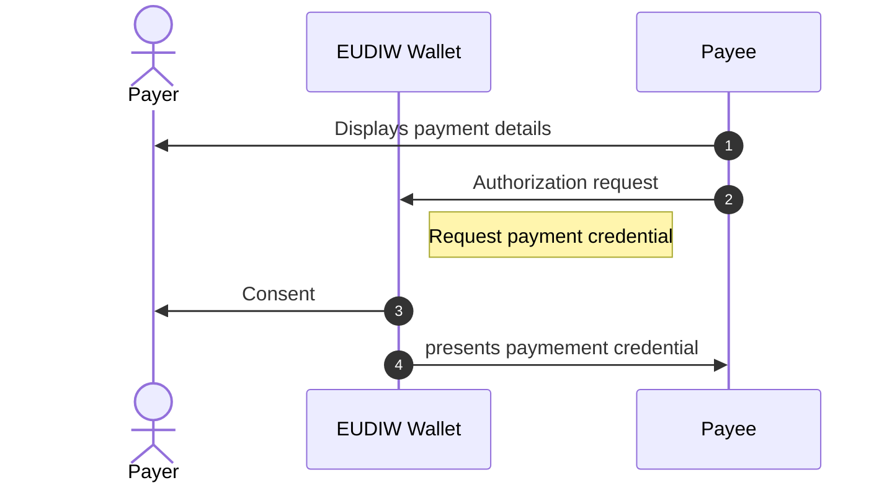
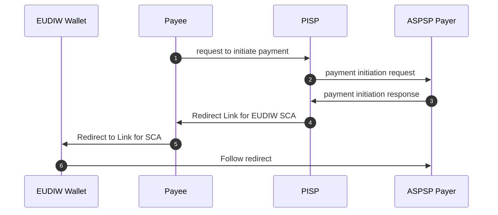
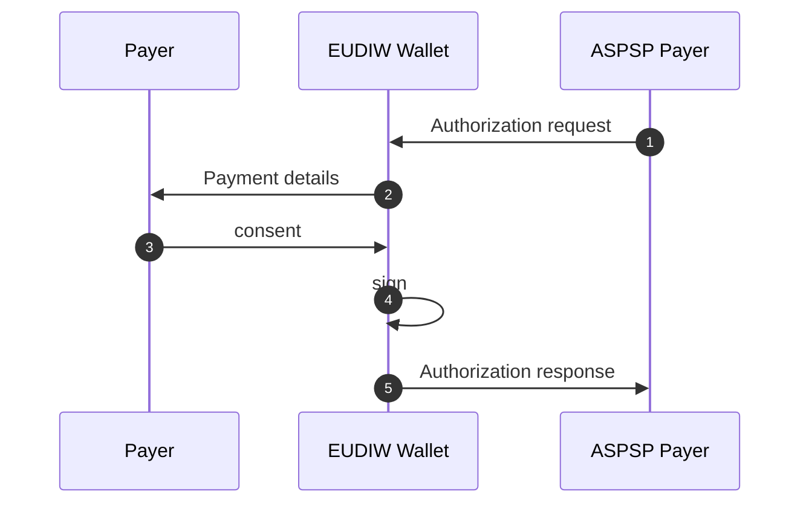
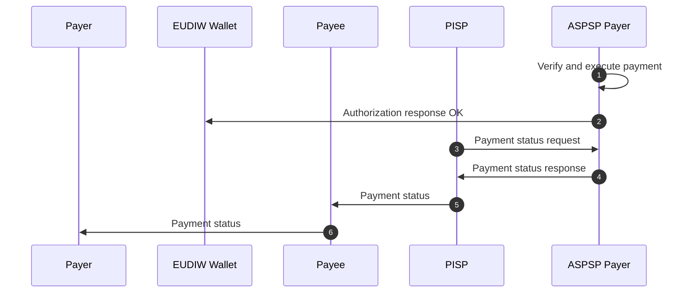

# SCA based on OpenID4VP using OpenBanking

## Abstract
Open banking is a financial concept allowing third-party financial service providers to access customer banking data through APIs (Application Programming Interfaces). This innovation enables customers to securely authorize payment or share their financial information with other financial institutions or third-party providers. 

Strong Customer Authentication (SCA) is a crucial requirement under the Revised Payment Service Directive (PSD2) aimed at enhancing the security of electronic payments. To meet SCA standards in open banking, banks must implement multi-factor authentication, typically involving two out of three factors: 

- knowledge (e.g., password or PIN)
- possession (e.g., mobile phone)
- and inherence (e.g., biometrics like fingerprint or facial recognition). 

This additional layer of security is essential to combat fraud in online transactions and protect both financial institutions and consumers. Today there exist multiple ways on how SCA can be performed. 

- **Redirected**: The Redirected SCA approach described in XS2A section 5.1.1[^xs2a] involves redirecting users to their bank's authentication interface during a payment transaction to complete the authorization process. This method presents a pre-populated credit transfer screen for the user's confirmation, making it a semi-automated process where the flow is controlled by the user, initiating the payment themselves Embedded
- **Embedded**: The Embedded SCA approach described in XS2A section 5.1.8[^xs2a] involves a fully automated process where the payment is initiated on behalf of the Payment Service User (PSU) by the Third-Party Provider (TPP). In this method, the user shares their credentials with the TPP, who then authenticates and initiates the payment in the background, embedding the authentication process seamlessly within the transaction flow.
- **Decoupled**: The Decoupled approach described in XS2A section 5.1.7[^xs2a] offers a convenient method to obtain SCA approval with minimal effort from the merchant or cardholder. This approach allows transactions to occur without the cardholder being actively engaged with the merchant's website or mobile application. Instead, authentication is conducted through alternative channels, such as mobile push notifications within banking apps, email, or other methods chosen by the Issuer bank to inform the cardholder of an authentication request from a merchant.

This document is focussing on the option to leverage the OpenID4VP[^openid4vp] and OpenID4VCi[^openid4vci] specifications in order to introduce a standardized approach to allow compatible wallet applications to act as an authentication mean for SCA. 


## Terminology

- **ASPSP**: Account Serving Payment Service Provider 
- **Wallet**: An entity that receives, stores, presents, and manages credentials and key material of the End User. A wallet is defined as a nativ mobile application.
- **Payment credential** : A verifiable credential issued by an ASPSP to a customer. The credential must be cryptographically bound to a private key residing in the wallet.
- **Decentralized Identifier**: An identifier with its core ability being enabling Clients to obtain key material and other metadata by reference, defined in DID Core [^did].
- **Payment request credential**: A self-attested verifiable credential generated by the wallet containing the details for a transaction that needs to be authorized. The credential must always be signed using the private key connected to the Payment credential.

## Disclaimer
In order to make the process and the examples clearer, this document makes some opinionated choices regarding formats, schemas, identifiers etc. which might differ in a complex real world scenario. 

## Flow

Brief description of a payment initation flow using a payment initiation service (PIS) described in XS2A section 5[^xs2a]. Note: Besides payment initiation, the flow can also be used to authorize other kind of transaction like logging into online banking e.g.. 

## Onboarding

Prior to using a wallet as a mean for SCA, it requires an onboarding to exchange a cryptographic key-set between the ASPSP and a customer wallet. The exchange is done by the ASPSP issuing a payment credential using OpenID4VCi [^openid4vci]. 

### Payment Credential

The payment credential MUST be cryptographically bound to a dedicated private key created by the wallet and used to sign a `proof` while requesting the issuing of a Payment credential as described in OpenID4VCi, section 7.2[^openid4vci]. The `proof` parameter is therefor always REQUIRED.

The `credentialSubject` includes the following properties:

- `aspsp_name`: RECOMMENDED. Name of the issuing ASPSP.
- `iban`: REQUIRED.

Example of an issued Payment credential.

```json
{
  "iss": "did:jwk:eyJjcnYiOiJQLi...,
  "jti": "dc961165-fb13-4d19-98f0-37c9bb06be",
  "nbf": 1707232027,
  "aud": "EUDIW",
  "nonce": "a2bcc3e0-623d-441d-aa80-31d82aa665d1",
  "sub": "did:jwk:eyJrdHkiOiJFi...",
  "vc": {
    "@context": [
      "https://www.w3.org/2018/credentials/v1",
      "https://w3id.org/security/suites/jws-2020/v1"
    ],
    "type": [
      "VerifiableCredential",
      "PaymentKey"
    ],
    "credentialSubject": {
      "aspsp_name": "Super Bank",
      "iban": "DE40100100103307118608"
    }
  }
}

```

## Payment

### Present payment credential



1. The payee displays the payment details to the payer. The payer decides to pay by using his wallet and the issued payment credential.
2. The payee requests the presentation of a Payment credential as defined by OpenID4VP[^openid4vp]. This is done either
    - **cross-device** by presenting it as a QR code / NFC Tag or
    - **same-device** by activating a link with a custom URL scheme.
3. The payer selects an apropriate payment credential and consents to its presentation to the payee.
4. The payment credential is send to the payee.

### Payment initiation



1. Once the payee verified the presented payment credential, it initiates a payment using a payment initiation service provider (PISP). The presented Payment credential must be send along with the payment details.
2. The PISP uses the information included in the payment credential to initiate a payment at the payers ASPSP (aka the issuer of the payment credential) utilizing an OpenBanking API payment initiation request.
3. In response, the ASPSP of the payer sends the link to authorize the payment to the PISP.
4. The PISP forwards the authorization link to the merchant.
5. The payee forwards the authorization link to the wallet. This step might be done as an automatic redirect.
6. The wallet follows the authorization link to initiate the SCA.

### SCA payment authorization




1. The ASPSP performs an SCA by requesting a self-attested payment request credential as described in Request2sign[^r2s]. Thereby the authorization request must contain
    - the actual payload for the transaction in the `authorization_details` and 
    - the `presentation_definition` requesting a self-attested credential that will include the payload.
2. The `input_descriptor` with the `id` `request2sign_input` will also provide a JSON schema the wallet can use to dynamically generate a form to display the content of the `authorization_details` to the user and ask for consent.
3. The user consents to the presentation of the payment request credential by providing the first factor like a wallet PIN or biometrics.
4. The wallet creates a payment request credential linked dynamically to the transaction by including the transaction details and signs it using the private key as the second factor.
5. The payment request credential is send to the ASPSP as part of the authorization response.

Example of a complete authorization request object:

```json
{
  "aud": "EUDIW",
  "authorization_details": [
    {
      "type": "request2sign",
      "payload": {
        "instructedAmount": {
          "amount": "5.59",
          "currency": "EUR"
        },
        "paymentIdentification": {
          "endToEndIdentification": "CDF834F4-5CF4-4A27-9C04-9EEB347BF"
        },
        "remittanceInformationUnstructured": [
          "Shopping at Merchant A"
        ],
        "creditor": {
          "additionalPartyInformation": {
            "merchantCallbackUrl": "https://merchant.com/callback"
          },
          "name": "Merchant A"
        },
        "creditorAccount": {
          "iban": "DE88940594210020801890"
        }
      }
    }
  ],
  "client_id": "did:jwk:eyJrdHkiOiJFQ...",
  "client_id_scheme": "did",
  "iss": "did:jwk:eyJrdHkiOiJFQ...",
  "nonce": "CPxpkYdz2ECNwYAx",
  "presentation_definition": {
    "id": "32f54163-7166-48f1-93d8-ff217bdb0653",
    "input_descriptors": [
      {
        "id": "request2sign_input",
        "constraints": {
          "subject_is_issuer": "required",
          "fields": [
            {
              "id": "request2sign_payload",
              "path": [
                "$.credentialSubject.request2sign_payload"
              ],
              "filter": {
                "$schema": "https://json-schema.org/draft/2020-12/schema",
                "type": "object",
                "properties": {
                  "instructedAmount": {
                    "type": "object",
                    "properties": {
                      "currency": {
                        "type": "string",
                        "title": "Currency",
                        "description": "Currency the amount is payed in."
                      },
                      "amount": {
                        "type": "string",
                        "title": "Amount",
                        "description": "Amount of money to pay.",
                        "example": "1.99"
                      }
                    },
                    "required": [
                      "currency",
                      "amount"
                    ]
                  },
                  "creditorName": {
                    "type": "string",
                    "title": "Creditor",
                    "description": "Creditor receiving the money"
                  },
                  "creditorAccount": {
                    "type": "object",
                    "properties": {
                      "iban": {
                        "type": "string",
                        "title": "IBAN"
                      }
                    },
                    "required": [
                      "iban"
                    ]
                  },
                  "remittanceInformationUnstructured": {
                    "type": "string",
                    "title": "Purpose"
                  }
                },
                "required": [
                  "instructedAmount",
                  "creditorName",
                  "creditorAccount",
                  "remittanceInformationUnstructured"
                ]
              }
            },
            {
              "id": "issuer",
              "path": [
                "$.iss"
              ],
              "filter": {
                "type": "string",
                "const": "did:example:sd5sde"
              }
            },
            {
              "id": "subject",
              "path": [
                "$.sub"
              ],
              "filter": {
                "type": "string",
                "const": "did:example:sd5sde"
              }
            }
          ]
        }
      }
    ]
  },
  "response_mode": "direct_post",
  "response_type": "vp_token",
  "response_uri": "https://bank.com/verifier/present",
  "state": "DUcDuyi8efXwAsB6"
}

```

Example of a self-attested payment request credential:

```json
{
  "iss": "did:jwk:eyJrdHkiOiJFi...",
  "jti": "dc961165-fb13-4d19-98f0-37c9bb06be",
  "nbf": 1707232027,
  "aud": "EUDIW",
  "nonce": "a2bcc3e0-623d-441d-aa80-31d82aa665d1",
  "sub": "did:jwk:eyJrdHkiOiJFi...",
  "vc": {
    "@context": [
      "https://www.w3.org/2018/credentials/v1",
      "https://w3id.org/security/suites/jws-2020/v1"
    ],
    "type": [
      "VerifiableCredential",
      "Request2Sign",
      "PaymentRequest"
    ],
    "credentialSubject": {
        "request2sign_payload" : {
          "instructedAmount": {
             "currency": "EUR",
             "amount": "123.50"
          },
          "creditorName": "Merchant A",
          "creditorAccount": {
             "iban": "DE02100100109307118603"
          },
          "remittanceInformationUnstructured": "Ref Number Merchant"
       }
    }
  }
}

```

### Payment Status



1. The ASPSP verifies the payment request credential using the public key of the payer.
2. The ASPSP signals the wallet that the credential has been received and verified successfully.
3. The PISP polls the status of the payment using OpenBanking APIs. Alternativly this might also be done using a dedicated callback if offered by the ASPSP.
4. The ASPSP communicates the status of the payment to the PISP.
5. The PISP communicates the status of the payment to the payee.
6. The PISP communicates the status of the payment to the payer.


[^xs2a]: [NextGenPSD2 XS2A Framework Implementation Guidelines](https://www.berlin-group.org/_files/ugd/c2914b_fec1852ec9c640568f5c0b420acf67d2.pdf)
[^r2s]:[Request to sign based on OpenID4VP](openid4vp-r2s.md)
[^openid4vp]: [OpenID4VP - draft 20](https://openid.net/specs/openid-4-verifiable-presentations-1_0.html)
[^openid4vci]: [OpenID4VCI - draft 13](https://openid.net/specs/openid-4-verifiable-credential-issuance-1_0.html)
[^did]:[Decentralized Identifiers - DIDs v1.0](https://www.w3.org/TR/did-core/)
