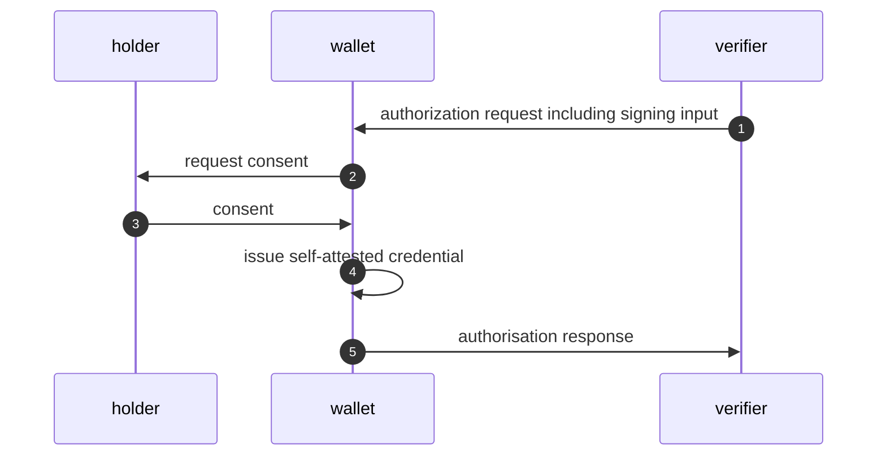

# Request to sign based on OpenID4VP

This specification proposes a behavioral extensions to the mechanisms of OpenID for Verfifiable Presentation[^openid4vp] in order to enable the request of self-attested credentials from a holder (wallet) which must include a dataset that is provided by a verifier. 

The motivation for this extension is to dynamically link contextual data to an previously issued credential and its related cryptographic key by digital signatures. An example for this requirement is a strong customer authentication (SCA)[^sca] required by the PSD2 regulation in the financial sector. 

## Requirements Notation and Conventions

The key words "**MUST**", "**MUST NOT**", "**REQUIRED**", "**SHALL**", "**SHALL NOT**",
"**SHOULD**", "**SHOULD NOT**", "**RECOMMENDED**", "**NOT RECOMMENDED**", "**MAY**", and
"**OPTIONAL**" in this document are to be interpreted as described in BCP 14 RFC2119[^rfc2119] and RFC8174 [^rfc8174] when, and only when, they appear in all capitals, as shown here.

## Terminology

This specification defines the following terms.

- **Credential**: A set of one or more claims about a subject made by a Credential Issuer.
- **Credential issuer**: An entity that issues Verifiable Credentials. Also called Issuer.
- **Holder**: An entity that receives Verifiable Credentials and has control over them to present them to the Verifiers as Verifiable Presentations.
- Self-attested credential: A credential that has been issued by and to its holder. 
- **Wallet**: An entity used by the Holder to receive, store, present, and manage Verifiable Credentials and key material. 
- **Signing Input**: Data provided by a Verifier that needs to be included in the Presentation of the credential.
- **Presentation**: Data that is presented to a specific Verifier, derived from one or more Verifiable Credentials that can be from the same or different Credential Issuers.
- **Verifier**: An entity that requests, receives, and validates Verifiable Credential and Presentations.

## Flow

This flow builds largly on already existing flows and features of OpenID4VP and its referenced specifications. However, it defines certain keywords for the wallet to trigger the processing of the signing input and to include it within a self-attested credential.




1. The verifier sends an OpenID4VP authorization request to the wallet. The authorization request contains the signing input.
2. The wallet presents the signing input to the holder and asks for consent to present it back to the verifier.
3. The holder consents to the presentation.
4. The wallet issues a self-attested credential which includes the data of the signing input.
5. The self-attested credential will be included in the presentation and send along with the authorization response.


## Authorization request

The authorization request as defined in OpenID4VP section 5[^openid4vp] MUST be transported as OAuth 2.0 rich authorization request to include a container holding the input data for the self-attested credential in the request parameter `authorization_details` as defined in RFC 9396, section 2[^rfc9396]. The `authorization_details` array hereby MUST include a JSON object with the `type` field set to the *keyword* value of `request2sign`. 

The `request2sign`object defines the following fields:

- `payload`: REQUIRED. JSON object holding the signing input data that must be included in the self-attested credential by the wallet.

Example of the `authorization_details`:

```json
[
  {
    "type": "request2sign",
    "payload": {
      "instructedAmount": {
        "amount": "5.59",
        "currency": "EUR"
      },
      "transactionID": "CDF834F4-5CF4-4A27-9C04-9EEB347BF",
      "purpose": "Shopping somewhere",
      "creditorAccount": {
        "iban": "DE88940594210020801890",
        "name": "Merchant A"
      }
    }
  }
]
```

### Presentation definition

The `presentation_definition` used in the authorization request is a critical component within this flow and must adhere to the folllowing rules.

1. It MUST include an `input_descriptor` by the `id` of `request2sign_input`. This keyword indicates to the wallet that a self-attested credential is requested which must include the signing input data send along by the verifier within the authorization request. 
2. The `request2sign_input` input descriptor MUST request a self-attested credential using the `subject_is_issuer` property of the relational constraint feature described in Presentation Exchange 2.0, section 7.3[^dif_pe]. 
3. The `request2sign_input` input descriptor MUST request a `field` with the id `request2sign_payload`. This field will hold the signing input data.
4. The `filter` property of the `request2sign_payload` MUST include a JSON schema of the singing input data structure. The wallet MUST use this schema to dynamically render a UI form to present the data to the holder while asking for consent. For an improved user experience, it is RECOMMENDED to make use of JSON schema annotations[^js_an][^js_an_example] like `title`, `description` and `example`.

Example of a presentation definition requesting a self-attested credential issued by `did:example:sd5sde`:

```json
{
  "presentation_definition": {
    "id": "32f54163-7166-48f1-93d8-ff217bdb0653",
    "input_descriptors": [
      {
        "id": "request2sign_input",
        "constraints": {
          "subject_is_issuer": "required",
          "fields": [
            {
              "id": "request2sign_payload",
              "path": [
                "$.credentialSubject.request2sign_payload"
              ],
              "filter": {
                "$schema": "https://json-schema.org/draft/2020-12/schema",
                "type": "object",
                "properties": {
                  "instructedAmount": {
                    "type": "object",
                    "title": "Amount",
                    "properties": {
                      "amount": {
                        "type": "string",
                        "title": "Amount",
                        "description": "Amount to pay"
                      },
                      "currency": {
                        "type": "string",
                        "title": "Currency",
                        "description": "Currency to pay in"
                      }
                    },
                    "required": [
                      "amount",
                      "currency"
                    ]
                  },
                  "transactionID": {
                    "type": "string",
                    "title": "Transaction ID",
                    "description": "Unique transaction identifier"
                  },
                  "purpose": {
                    "type": "string",
                    "title": "Purpose",
                    "description": "Purpose of the transaction"
                  },
                  "creditorAccount": {
                    "type": "object",
                    "title": "Creditor",
                    "properties": {
                      "iban": {
                        "type": "string",
                        "title": "IBAN",
                        "description": "IBAN of the creditor"
                      },
                      "name": {
                        "type": "string",
                        "title": "Name",
                        "description": "Name of the creditor"
                      }
                    },
                    "required": [
                      "iban",
                      "name"
                    ]
                  }
                },
                "required": [
                  "instructedAmount",
                  "transactionID",
                  "purpose",
                  "creditorAccount"
                ]
              }
            },
            {
              "id": "issuer",
              "path": [
                "$.iss"
              ],
              "filter": {
                "type": "string",
                "const": "did:example:sd5sde"
              }
            },
            {
              "id": "subject",
              "path": [
                "$.sub"
              ],
              "filter": {
                "type": "string",
                "const": "did:example:sd5sde"
              }
            }
          ]
        }
      }
    ]
  }
}
```

### Processing

The processing of an OpenID4VP authorization request by the wallet must be extended by the following steps.

1. Incoming authorization request must be checked if `$.authorization_details.[?(@.type==request2sign)]` returns exactly one result.
2. If yes, check if `$.presentation_definition.input_descriptors.[?(@.id==request2sign_input`)]` returns exactly one result
3. If yes, check if this `input_descriptor`has a relational contraint `subject_is_issuer` set to `required`.
4. If yes, check if this `input_descriptor` requests a field with the id `request2sign_payload` and the `filter` property set to a JSON schema that matches the `request2sign` object from the `authorization_details`. 
5. If yes, based on the `filter` JSON schema object, render a consent dialog to present the data of the `request2sign` object to the holder.


[^rfc9396]: [RFC 9396 OAuth 2.0 Rich Authorization Requests](https://www.rfc-editor.org/rfc/rfc9396.html)
[^openid4vp]: [OpenID4VP - draft 20](https://openid.net/specs/openid-4-verifiable-presentations-1_0.html)
[^rfc2119]: [RFC 2119](https://datatracker.ietf.org/doc/html/rfc2119)
[^rfc8174]: [RFC 8174](https://datatracker.ietf.org/doc/html/rfc8174)
[^sca]: [Strong-Customer-Authentication](https://eur-lex.europa.eu/legal-content/EN/TXT/?uri=CELEX:32018R0389)
[^dif_pe]: [Presentation Exchange 2.0](https://identity.foundation/presentation-exchange/spec/v2.0.0/#validation-of-claims)
[^js_an]: [JSON Schema Annotations](https://json-schema.org/understanding-json-schema/reference/annotations)
[^js_an_example]: [Example dynamic form generation based on JSON Schema](https://rjsf-team.github.io/react-jsonschema-form/#eyJmb3JtRGF0YSI6eyJpbnN0cnVjdGVkQW1vdW50Ijp7ImFtb3VudCI6IjUuNTkiLCJjdXJyZW5jeSI6IkVVUiJ9LCJ0cmFuc2FjdGlvbklEIjoiQ0RGODM0RjQtNUNGNC00QTI3LTlDMDQtOUVFQjM0N0JGIiwicHVycG9zZSI6IlNob3BwaW5nIHNvbWV3aGVyZSIsImNyZWRpdG9yQWNjb3VudCI6eyJpYmFuIjoiREU4ODk0MDU5NDIxMDAyMDgwMTg5MCIsIm5hbWUiOiJNZXJjaGFudCBBIn19LCJzY2hlbWEiOnsiJHNjaGVtYSI6Imh0dHA6Ly9qc29uLXNjaGVtYS5vcmcvZHJhZnQtMDQvc2NoZW1hIyIsInR5cGUiOiJvYmplY3QiLCJwcm9wZXJ0aWVzIjp7Imluc3RydWN0ZWRBbW91bnQiOnsidHlwZSI6Im9iamVjdCIsInRpdGxlIjoiQW1vdW50IiwicHJvcGVydGllcyI6eyJhbW91bnQiOnsidHlwZSI6InN0cmluZyIsInRpdGxlIjoiQW1vdW50IiwiZGVzY3JpcHRpb24iOiJBbW91bnQgdG8gcGF5In0sImN1cnJlbmN5Ijp7InR5cGUiOiJzdHJpbmciLCJ0aXRsZSI6IkN1cnJlbmN5IiwiZGVzY3JpcHRpb24iOiJDdXJyZW5jeSB0byBwYXkgaW4ifX0sInJlcXVpcmVkIjpbImFtb3VudCIsImN1cnJlbmN5Il19LCJ0cmFuc2FjdGlvbklEIjp7InR5cGUiOiJzdHJpbmciLCJ0aXRsZSI6IlRyYW5zYWN0aW9uIElEIiwiZGVzY3JpcHRpb24iOiJVbmlxdWUgdHJhbnNhY3Rpb24gaWRlbnRpZmllciJ9LCJwdXJwb3NlIjp7InR5cGUiOiJzdHJpbmciLCJ0aXRsZSI6IlB1cnBvc2UiLCJkZXNjcmlwdGlvbiI6IlB1cnBvc2Ugb2YgdGhlIHRyYW5zYWN0aW9uIn0sImNyZWRpdG9yQWNjb3VudCI6eyJ0eXBlIjoib2JqZWN0IiwidGl0bGUiOiJDcmVkaXRvciIsInByb3BlcnRpZXMiOnsiaWJhbiI6eyJ0eXBlIjoic3RyaW5nIiwidGl0bGUiOiJJQkFOIiwiZGVzY3JpcHRpb24iOiJJQkFOIG9mIHRoZSBjcmVkaXRvciJ9LCJuYW1lIjp7InR5cGUiOiJzdHJpbmciLCJ0aXRsZSI6Ik5hbWUiLCJkZXNjcmlwdGlvbiI6Ik5hbWUgb2YgdGhlIGNyZWRpdG9yIn19LCJyZXF1aXJlZCI6WyJpYmFuIiwibmFtZSJdfX0sInJlcXVpcmVkIjpbImluc3RydWN0ZWRBbW91bnQiLCJ0cmFuc2FjdGlvbklEIiwicHVycG9zZSIsImNyZWRpdG9yQWNjb3VudCJdfSwidWlTY2hlbWEiOnsiZmlyc3ROYW1lIjp7InVpOmF1dG9mb2N1cyI6dHJ1ZSwidWk6ZW1wdHlWYWx1ZSI6IiIsInVpOnBsYWNlaG9sZGVyIjoidWk6ZW1wdHlWYWx1ZSBjYXVzZXMgdGhpcyBmaWVsZCB0byBhbHdheXMgYmUgdmFsaWQgZGVzcGl0ZSBiZWluZyByZXF1aXJlZCIsInVpOmF1dG9jb21wbGV0ZSI6ImZhbWlseS1uYW1lIiwidWk6ZW5hYmxlTWFya2Rvd25JbkRlc2NyaXB0aW9uIjp0cnVlLCJ1aTpkZXNjcmlwdGlvbiI6Ik1ha2UgdGV4dCAqKmJvbGQqKiBvciAqaXRhbGljKi4gVGFrZSBhIGxvb2sgYXQgb3RoZXIgb3B0aW9ucyBbaGVyZV0oaHR0cHM6Ly9tYXJrZG93bi10by1qc3gucXVhbnRpem9yLmRldi8pLiJ9LCJsYXN0TmFtZSI6eyJ1aTphdXRvY29tcGxldGUiOiJnaXZlbi1uYW1lIiwidWk6ZW5hYmxlTWFya2Rvd25JbkRlc2NyaXB0aW9uIjp0cnVlLCJ1aTpkZXNjcmlwdGlvbiI6Ik1ha2UgdGhpbmdzICoqYm9sZCoqIG9yICppdGFsaWMqLiBFbWJlZCBzbmlwcGV0cyBvZiBgY29kZWAuIDxzbWFsbD5BbmQgdGhpcyBpcyBhIHNtYWxsIHRleHRzLjwvc21hbGw+ICJ9LCJhZ2UiOnsidWk6d2lkZ2V0IjoidXBkb3duIiwidWk6dGl0bGUiOiJBZ2Ugb2YgcGVyc29uIiwidWk6ZGVzY3JpcHRpb24iOiIoZWFydGggeWVhcikifSwiYmlvIjp7InVpOndpZGdldCI6InRleHRhcmVhIn0sInBhc3N3b3JkIjp7InVpOndpZGdldCI6InBhc3N3b3JkIiwidWk6aGVscCI6IkhpbnQ6IE1ha2UgaXQgc3Ryb25nISJ9LCJ0ZWxlcGhvbmUiOnsidWk6b3B0aW9ucyI6eyJpbnB1dFR5cGUiOiJ0ZWwifX19LCJ0aGVtZSI6ImRlZmF1bHQiLCJsaXZlU2V0dGluZ3MiOnsic2hvd0Vycm9yTGlzdCI6InRvcCIsInZhbGlkYXRlIjpmYWxzZSwiZGlzYWJsZWQiOmZhbHNlLCJub0h0bWw1VmFsaWRhdGUiOmZhbHNlLCJyZWFkb25seSI6dHJ1ZSwib21pdEV4dHJhRGF0YSI6ZmFsc2UsImxpdmVPbWl0IjpmYWxzZSwiZXhwZXJpbWVudGFsX2RlZmF1bHRGb3JtU3RhdGVCZWhhdmlvciI6eyJhcnJheU1pbkl0ZW1zIjoicG9wdWxhdGUiLCJhbGxPZiI6InNraXBEZWZhdWx0cyIsImVtcHR5T2JqZWN0RmllbGRzIjoicG9wdWxhdGVBbGxEZWZhdWx0cyJ9fX0=)
