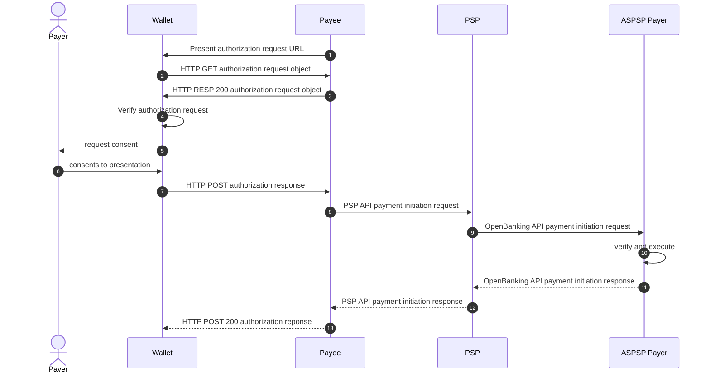

# Strong-customer-authentication for electronic payments for the eIDAS2 EUDI Wallet

## Background
Strong Customer Authentication (SCA) is a crucial requirement under the Revised Payment Service Directive (PSD2) aimed at enhancing the security of electronic payments. To meet SCA standards in open banking, banks must implement multi-factor authentication, typically involving two out of three factors: 

- knowledge (e.g., password or PIN)
- possession (e.g., mobile phone)
- and inherence (e.g., biometrics like fingerprint or facial recognition). 

This additional layer of security is essential to combat fraud in online transactions and protect both financial institutions and consumers. Today there exist multiple ways on how SCA can be performed. 

- **Redirected**: The Redirected SCA approach described in XS2A section 5.1.1[^xs2a] involves redirecting users to their bank's authentication interface during a payment transaction to complete the authorization process. This method presents a pre-populated credit transfer screen for the user's confirmation, making it a semi-automated process where the flow is controlled by the user, initiating the payment themselves Embedded
- **Embedded**: The Embedded SCA approach described in XS2A section 5.1.8[^xs2a] involves a fully automated process where the payment is initiated on behalf of the Payment Service User (PSU) by the Third-Party Provider (TPP). In this method, the user shares their credentials with the TPP, who then authenticates and initiates the payment in the background, embedding the authentication process seamlessly within the transaction flow.
- **Decoupled**: The Decoupled approach described in XS2A section 5.1.7[^xs2a] offers a convenient method to obtain SCA approval with minimal effort from the merchant or cardholder. This approach allows transactions to occur without the cardholder being actively engaged with the merchant's website or mobile application. Instead, authentication is conducted through alternative channels, such as mobile push notifications within banking apps, email, or other methods chosen by the Issuer bank to inform the cardholder of an authentication request from a merchant.

Dynamic linking is another key requirement under the Strong Customer Authentication (SCA) rules of the PSD2 for remote electronic payment transactions. It aims to ensure the integrity of the transaction by cryptographically linking the payment details to the customer's authentication. Here's how it works:

Dynamic linking requires at least two elements to be used for SCA compliance:

1. An authentication code or cryptogram that is uniquely linked to the specific payment amount and payee account. This is typically generated using the customer's authentication factors (e.g. biometrics, PIN, etc.)

2. The payment details themselves, including the amount and payee account details.

These two elements must be dynamically presented to the customer during authentication, ensuring they are verifying the actual payment details. The authentication code cryptographically binds the customer's identity to those payment specifics.

This prevents man-in-the-middle attacks where payment details could be modified after authentication. It also stops replay attacks reusing authentication codes across multiple transactions.

The dynamic linking process varies by authentication method, but often involves the customer's mobile app displaying the payment amount and merchant details alongside the authentication prompt. The authentication response then includes a cryptogram calculated over those payment details, dynamically linking them.

Article 5(1) of the Delegated Regulation (EU) 2018/389 states that: Where payment service providers apply strong customer authentication in accordance with Article 97(2) of Directive (EU) 2015/2366, in addition to the requirements of Article 4, they shall adopt security measures that meet each of the following requirements: 
1. the payer is made aware of the amount of the payment transaction and of the payee; 
2. the authentication code generated is specific to the amount of the payment transaction and the payee agreed to by the payer when initiating the transaction; 
3. the authentication code accepted by the payment service provider corresponds to the original specific amount of the payment transaction and to the identity of the payee agreed to by the payer; 
4. any change to the amount or the payee results in the invalidation of the authentication code generated.

In summary, dynamic linking is crucial for ensuring SCA provides true transaction integrity and non-repudiation under PSD2's remote electronic payment rules.

### eIDAS 2.0

The European Digital Identity Regulation (Regulation (EU) 2024/1183) obliges European payment service providers (PSP) to accept the EU Digital Identity Wallet (EUDIW) for SCA as [this paper](https://lange-hausstein.de/wp-content/uploads/2023/11/231120_DP-No.-1_EUDIW-for-SCA_EN_public.pdf) discusses in more detail.

### Architecture Reference Framework

Along with the regulation, the European Commision provides a set of technical specification and recommondations regarding the development of the European Digital Identity Wallet infrastructure through the Architecture Reference Framework (ARF)[^arf]. The ARF specifically proposes the following protocols for the remote issuing and presentation of Electronic Attestations of Attributes (EAA, see ARF Annex 1[^arf_annex1]). 

- **OpenID4VCI[^openid4vci]**
- **OpenID4VP[^openid4vp]** 

In order to be able to combine payment with other EAAs in a synergistical manner as described in ARF Annex2 section A.2.3.18 Topic 18[^arf_annex2], this document in focusing on leveraging these specification to perform SCA and authorize electronic payment transactions as described further in ARF, section A.2.3.20 Topic 20[^arf_annex2].

#### Security presumtions
- the wallets secure cryptographic device (WSCD) is used to securly generate and store a device-bound cryptographic key that is used to digitally sign a payment transaction (possesion) AND
- the access to the key stored in the wallets WSCD is protected by a PIN only known to the holder (knowledge) OR biometrics (inherence).

## Registration
The (one-time) registration process links the holders wallet instance and their PSP managing the account used for payments. It also allows the PSP to establish a trust relationship to the wallet by verifying its authenticity as described in more detail in ARF, section 6.6.2[^arf].

During registration, the PSP aka issuer issues a dedicated EAA (hereinafter called A2Pay - Attestation to pay) to the wallet using OpenID4VCI [^openid4vci] according to the OpenID4VC High Assurance Interoperability Profile using SD-JWT VC [^openid4vc_hip]. OpenID4VCI allows the issuer to issue an EAA within an authenticated / authorized context. Exactly how this context is establish is left to the issuer and is out of the scope of this document, however possible options and combinations of them are:

- Login credentials (OnlineBanking e.g.)
- OTP
- 2FA Apps (Propriatary Banking Apps e.g.)

As stated in ARF section 6.6.6.3, 6.6.3.7[^arf] and also ARF Annex 2 section A.2.3.9 Topic 9[^arf_annex2], the issued A2Pay is cryptographically linked to a private key protected by the Wallet Secure Cryptographic Application(s) (WSCA) and the corresponding Wallet Secure Cryptographic Device(s) (WSCD). During the issuing process, the corresponding public key is handed to the PSP which must store it along with the holders account data, as it must be used to verify payment transactions authorized / signed by the holder.

The private key constitutes the major factor to implement SCA within the wallet. Regarding its security, the following assumptions are made.
- the key to sign payment transactions is bound to the WSCD of the wallet and cannnot be extraxted. Therefor the key provides the factor possesion for SCA. AND
- the access to the key is always protected by a PIN only known to the holder OR biometrics providing the factors knowledge OR inherence. 


### Attestation to pay - A2Pay

The A2Pay is used to identify the holders PSP and the account the attestation is connected with. In addition to that, the attestation may also state a payment rail along with required metadata that a relying party (merchant e.g.) might use to initiate a payment transaction.  

The data schema for A2Pay is described in detail within the json schema file [a2pay-schema.json](a2pay-schema.json).

Non-normative example of an A2Pay as `sd-jwt`:

```
{
    "_sd": [],
    "iss": "https://bank.com/issuer",
    "exp": 1883000000,
    "nbf": 1718198433,
    "iat": 1718198433,
    "vct": "https://credentials.example.com/a2pay",
    "_sd_alg": "sha-256",
    "id": "8D8AC610-566D-4EF0-9C22-186B2A5ED793",
    "payment-product": "sct-inst-eu",
    "initiation-url": "https://bank.com/pay/7dfe5484g78/init",
    "iban": "DE75512108001245126199",
    "currency": "EUR",
    "name": "Account John Smith",
    "display-name": "My Account",
    "cnf": {
      "jwk": {
        "crv": "P-256",
        "kty": "EC",
        "x": "NASJ2ADuagOvraLf7O4VxcBMbantzL9dd0jpvMLnBfs",
        "y": "OJY6pqCqRIzpEt78OXasWHGgqV5ZGre_3cHtpNH82gg"
        }
    }
}


eyJhbGciOiJFUzI1NiJ9.ewogICAgIl9zZCI6IFtdLAogICAgImlzcyI6ICJodHRwczovL2JhbmsuY29tL2lzc3VlciIsCiAgICAiZXhwIjogMTg4MzAwMDAwMCwKICAgICJuYmYiOiAxNzE4MTk4NDMzLAogICAgImlhdCI6IDE3MTgxOTg0MzMsCiAgICAidmN0IjogImh0dHBzOi8vY3JlZGVudGlhbHMuZXhhbXBsZS5jb20vYTJwYXkiLAogICAgIl9zZF9hbGciOiAic2hhLTI1NiIsCiAgICAiaWQiOiAiOEQ4QUM2MTAtNTY2RC00RUYwLTlDMjItMTg2QjJBNUVENzkzIiwKICAgICJwYXltZW50LXByb2R1Y3QiOiAic2N0LWluc3QtZXUiLAogICAgImluaXRpYXRpb24tdXJsIjogImh0dHBzOi8vYmFuay5jb20vcGF5LzdkZmU1NDg0Zzc4L2luaXQiLAogICAgImFjY291bnQtcmVmZXJlbmNlIjogewogICAgICAgICJpYmFuIjogIkRFNzU1MTIxMDgwMDEyNDUxMjYxOTkiLAogICAgICAgICJjdXJyZW5jeSI6ICJFVVIiLAogICAgICAgICJuYW1lIjogIkFjY291bnQgSm9obiBTbWl0aCIsCiAgICAgICAgImRpc3BsYXktbmFtZSI6ICJNeSBBY2NvdW50IgogICAgfSwKICAgICJjbmYiOiB7CiAgICAgICJqd2siOiB7CiAgICAgICAgImNydiI6ICJQLTI1NiIsCiAgICAgICAgImt0eSI6ICJFQyIsCiAgICAgICAgIngiOiAiTkFTSjJBRHVhZ092cmFMZjdPNFZ4Y0JNYmFudHpMOWRkMGpwdk1MbkJmcyIsCiAgICAgICAgInkiOiAiT0pZNnBxQ3FSSXpwRXQ3OE9YYXNXSEdncVY1WkdyZV8zY0h0cE5IODJnZyIKICAgICAgICB9CiAgICB9Cn0.LdJLI0vaLFwGdXmrmqD6GsVW6YPS04yZnEfvBCLK_5ihiYZFbPBNNGEtrmTcdlDtPh2kNHy2x6ldCj7dQcAnPw
```

## Presentation

The presentation of the A2Pay 


### Dynamic linking


## Payment


1. Issuer (bank)



1. The payee requests the presentation of an A2Pay as defined by OpenID4VP[^openid4vp] and the proposed extension for transaction data[^openid4vp_td] . The authorization request URL is tranmitted
    - **cross-device** by presenting it as a QR code / NFC Tag or
    - **same-device** by activating a link with a custom URL scheme.
2. `HTTP GET` to load the OpenID4VP authorization request object
3. `HTTP GET 200` response including the OpenID4VP authorization request object signed by the payee[^jar]. The included `presentation_definition` requests the presentation of a valid payment credential from the wallet.
4. Verify the signature of the authorisation request
5. Wallet requests consent to present the payment credential including the transaction data (payment details) from the payer.
6. Payer consents to the presentation.
7. `HTTP POST` OpenID4VP authorization response using `response_mode=direct_post`. The response includes a verifiable presentation of a payment credential. This will trigger the payment initiation.
8. Once the payee verified the presented payment credential, it initiates a payment using a payment initiation service provider (PISP) by forwarding the signed presentation of the Payment credential.
9. The PISP uses the information included in the payment credential to initiate a payment utilizing an OpenBanking API payment initiation request and forwarding the signed presentation of the Payment credential to the payers ASPSP.
10. The ASPSP verifies the signed presentation of the Payment credential using the public key exchanged during onboarding. Upon a succesful verification, the ASPSP executes the payment.
11. The ASPSP returns the status of the payment to the PISP
12. The PISP returns the status of the payment to the payee 
13. `HTTP POST` 200 OK indicating the payment was successful

The authorization request includes the transaction data within the presentation definition. The `transaction_data` array holds an object according to the payment data model scheme[^payment_data_model]. 

Example of a complete authorization request object:

```json
{
  "aud": "EUDIW",
  "client_id": "did:jwk:eyJrdHkiOiJPS1AiLCJ1c2UiOiJzaWciLCJjcnYiOiJFZDI1NTE5Iiwia2lkIjoiYjlmNjQ1NTlmODY0NDZmMTkyOTJhZjM0ZGNlYTliZmIiLCJ4IjoibkNXTW9Lb1FYRzZLYm0yRGs1elI4UjdnMTh0cGxDVDZyUXVGOExxd1o0QSIsImFsZyI6IkVkRFNBIn0",
  "client_id_scheme": "did",
  "iss": "did:jwk:eyJrdHkiOiJPS1AiLCJ1c2UiOiJzaWciLCJjcnYiOiJFZDI1NTE5Iiwia2lkIjoiYjlmNjQ1NTlmODY0NDZmMTkyOTJhZjM0ZGNlYTliZmIiLCJ4IjoibkNXTW9Lb1FYRzZLYm0yRGs1elI4UjdnMTh0cGxDVDZyUXVGOExxd1o0QSIsImFsZyI6IkVkRFNBIn0",
  "nonce": "e346bf0f693f21c3d66785970104419671004e77b08195186dec96d3476eb25f",
  "presentation_definition": {
    "id": "32f54163-7166-48f1-93d8-ff217bdb0653",
    "transaction_data": [
      {
        "type": "payment_confirmation",
        "input_descriptor_ids": [ "payment" ],
        "instructedAmount": {
          "amount": "123,49",
          "currency": "EUR"
        },
        "paymentIdentification": {
          "endToEndIdentification": "CDF834F4-5CF4-4A27-9C04-9EEB347BF"
        },
        "remittanceInformationUnstructured": [
          "Shopping at Merchant A"
        ],
        "creditor": {
          "name": "Merchant A"
        },
        "creditorAccount": {
          "iban": "DE88940594210020801890"
        }
      }
    ],
    "input_descriptors": [
      {
        "id": "payment",
        "purpose": "Authorize the payment of 123,49 Euro to Merchant A, IBAN DE88940594210020801890 at 2024-03-21T09:46:14 - transaction id CDF834F4-5CF4-4A27-9C04-9EEB347BF",
        "path": [
          "$.vc.type"
        ],
        "filter": {
          "type": "string",
          "const": "PaymentKey"
        }
      }
    ]
  },
  "response_mode": "direct_post",
  "response_type": "vp_token",
  "response_uri": "https://bank.com/verifier/present",
  "state": "DUcDuyi8efXwAsB6"
}

```

Example of the returned `vp_token` containing the signed presentation of the payment credential:

```
eyJhbGciOiJFZERTQSIsImtpZCI6ImNkM2QyZWQ1NTY3ZDQyMzZhYzRlOTQzZmVlNDZkMzQ4In0.ewogICJpc3MiOiAiZGlkOmp3azpleUpyZEhraU9pSlBTMUFpTENKMWMyVWlPaUp6YVdjaUxDSmpjbllpT2lKRlpESTFOVEU1SWl3aWEybGtJam9pWTJRelpESmxaRFUxTmpka05ESXpObUZqTkdVNU5ETm1aV1UwTm1Rek5EZ2lMQ0o0SWpvaU1UZzFSbVJhYURGSGRUaGtVbEpmY25kaE1XUnlObXhhZERNdFNEUkNaRFJ1VXpaYVMxTnpSVlV4YXlJc0ltRnNaeUk2SWtWa1JGTkJJbjAiLAogICJqdGkiOiAidXJuOnV1aWQ6Y2FjYzg1MTgtODU2Ny00OGZkLWE4YjEtMDg1Yjk3ZTk1ODRkIiwKICAiYXVkIjogImRpZDpqd2s6ZXlKcmRIa2lPaUpQUzFBaUxDSjFjMlVpT2lKemFXY2lMQ0pqY25ZaU9pSkZaREkxTlRFNUlpd2lhMmxrSWpvaVlqbG1OalExTlRsbU9EWTBORFptTVRreU9USmhaak0wWkdObFlUbGlabUlpTENKNElqb2lia05YVFc5TGIxRllSelpMWW0weVJHczFlbEk0VWpkbk1UaDBjR3hEVkRaeVVYVkdPRXh4ZDFvMFFTSXNJbUZzWnlJNklrVmtSRk5CSW4wIiwKICAibmJmIjogMTcxODE5OTQ3MiwKICAiaWF0IjogMTcxODE5OTQ3MiwKICAiZXhwIjogMTcxODk5OTQ3MiwKICAibm9uY2UiOiAiZTM0NmJmMGY2OTNmMjFjM2Q2Njc4NTk3MDEwNDQxOTY3MTAwNGU3N2IwODE5NTE4NmRlYzk2ZDM0NzZlYjI1ZiIsCiAgInZwIjogewogICAgIkBjb250ZXh0IjogWwogICAgICAiaHR0cHM6Ly93d3cudzMub3JnLzIwMTgvY3JlZGVudGlhbHMvdjEiLAogICAgICAiaHR0cHM6Ly93d3cudzMub3JnLzIwMTgvY3JlZGVudGlhbHMvZXhhbXBsZXMvdjEiCiAgICBdLAogICAgInR5cGUiOiBbCiAgICAgICJWZXJpZmlhYmxlUHJlc2VudGF0aW9uIgogICAgXSwKICAgICJ2ZXJpZmlhYmxlQ3JlZGVudGlhbCI6IFsKICAgICAgImV5SnJhV1FpT2lKa2FXUTZhbmRyT21WNVNuSmtTR3RwVDJsS1VGTXhRV2xNUTBveFl6SlZhVTlwU25waFYyTnBURU5LYW1OdVdXbFBhVXBHV2tSSk1VNVVSVFZKYVhkcFlUSnNhMGxxYjJsYVJHUnFUa1JKTkZscVRtbGFiVTB6VGtkT2EwOVViRzFOUkUwMVQxZEZNRnBVUVRKWmFtaHJUVmRSYVV4RFNqUkphbTlwVkVWU2VXUllaM2xpUm1oRlRrWlNSVmd4UWsxTmExRXlWVWQ0VWxnelVrNWtWM2N4WTJwT01WSnNSakZSVkZJMlVsZHdibFJxVWpSUlUwbHpTVzFHYzFwNVNUWkphMVpyVWtaT1FrbHVNQ013SWl3aWRIbHdJam9pU2xkVUlpd2lZV3huSWpvaVJXUkVVMEVpZlEuZXlKcGMzTWlPaUprYVdRNmFuZHJPbVY1U25Ka1NHdHBUMmxLVUZNeFFXbE1RMG94WXpKVmFVOXBTbnBoVjJOcFRFTkthbU51V1dsUGFVcEdXa1JKTVU1VVJUVkphWGRwWVRKc2EwbHFiMmxhUkdScVRrUkpORmxxVG1sYWJVMHpUa2RPYTA5VWJHMU5SRTAxVDFkRk1GcFVRVEpaYW1oclRWZFJhVXhEU2pSSmFtOXBWRVZTZVdSWVozbGlSbWhGVGtaU1JWZ3hRazFOYTFFeVZVZDRVbGd6VWs1a1YzY3hZMnBPTVZKc1JqRlJWRkkyVWxkd2JsUnFValJSVTBselNXMUdjMXA1U1RaSmExWnJVa1pPUWtsdU1DSXNJbk4xWWlJNkltUnBaRHBxZDJzNlpYbEtjbVJJYTJsUGFVcFFVekZCYVV4RFNqRmpNbFZwVDJsS2VtRlhZMmxNUTBwcVkyNVphVTlwU2taYVJFa3hUbFJGTlVscGQybGhNbXhyU1dwdmFWa3lVWHBhUkVwc1drUlZNVTVxWkd0T1JFbDZUbTFHYWs1SFZUVk9SRTV0V2xkVk1FNXRVWHBPUkdkcFRFTktORWxxYjJsTlZHY3hVbTFTWVdGRVJraGtWR2hyVld4S1ptTnVaR2hOVjFKNVRtMTRZV1JFVFhSVFJGSkRXa1JTZFZWNldtRlRNVTU2VWxaVmVHRjVTWE5KYlVaeldubEpOa2xyVm10U1JrNUNTVzR3SWl3aWJtSm1Jam94TnpFNE1UazRORE16TENKcFlYUWlPakUzTVRneE9UZzBNek1zSW5aaklqcDdJblI1Y0dVaU9sc2lWbVZ5YVdacFlXSnNaVU55WldSbGJuUnBZV3dpTENKUVlYbHRaVzUwUzJWNUlsMHNJa0JqYjI1MFpYaDBJanBiSW1oMGRIQnpPaTh2ZDNkM0xuY3pMbTl5Wnk4eU1ERTRMMk55WldSbGJuUnBZV3h6TDNZeElpd2lhSFIwY0hNNkx5OTNkM2N1ZHpNdWIzSm5Mekl3TVRndlkzSmxaR1Z1ZEdsaGJITXZaWGhoYlhCc1pYTXZkakVpWFN3aWFXUWlPaUoxY200NmRYVnBaRHBtWm1RMllXUXhZaTB4WVRFeUxUUXdZelF0WWpSaE1pMHpOVFF3TXpNNFlqVmlaR1lpTENKcGMzTjFaWElpT25zaWFXUWlPaUprYVdRNmFuZHJPbVY1U25Ka1NHdHBUMmxLVUZNeFFXbE1RMG94WXpKVmFVOXBTbnBoVjJOcFRFTkthbU51V1dsUGFVcEdXa1JKTVU1VVJUVkphWGRwWVRKc2EwbHFiMmxhUkdScVRrUkpORmxxVG1sYWJVMHpUa2RPYTA5VWJHMU5SRTAxVDFkRk1GcFVRVEpaYW1oclRWZFJhVXhEU2pSSmFtOXBWRVZTZVdSWVozbGlSbWhGVGtaU1JWZ3hRazFOYTFFeVZVZDRVbGd6VWs1a1YzY3hZMnBPTVZKc1JqRlJWRkkyVWxkd2JsUnFValJSVTBselNXMUdjMXA1U1RaSmExWnJVa1pPUWtsdU1DSjlMQ0pwYzNOMVlXNWpaVVJoZEdVaU9pSXlNREkwTFRBMkxURXlWREV6T2pJd09qTXpXaUlzSW1semMzVmxaQ0k2SWpJd01qUXRNRFl0TVRKVU1UTTZNakE2TXpOYUlpd2lkbUZzYVdSR2NtOXRJam9pTWpBeU5DMHdOaTB4TWxReE16b3lNRG96TTFvaUxDSmpjbVZrWlc1MGFXRnNVM1ZpYW1WamRDSTZleUpwWkNJNkltUnBaRHBxZDJzNlpYbEtjbVJJYTJsUGFVcFFVekZCYVV4RFNqRmpNbFZwVDJsS2VtRlhZMmxNUTBwcVkyNVphVTlwU2taYVJFa3hUbFJGTlVscGQybGhNbXhyU1dwdmFWa3lVWHBhUkVwc1drUlZNVTVxWkd0T1JFbDZUbTFHYWs1SFZUVk9SRTV0V2xkVk1FNXRVWHBPUkdkcFRFTktORWxxYjJsTlZHY3hVbTFTWVdGRVJraGtWR2hyVld4S1ptTnVaR2hOVjFKNVRtMTRZV1JFVFhSVFJGSkRXa1JTZFZWNldtRlRNVTU2VWxaVmVHRjVTWE5KYlVaeldubEpOa2xyVm10U1JrNUNTVzR3SWl3aVlYTndjM0JmYm1GdFpTSTZJbE53WVhKcllYTnpaU0lzSW1GalkyOTFiblJmWVd4cFlYTWlPaUpOZVVGalkyOTFiblFpTENKaWFXTWlPaUpEVDB4VFJFVXpNMWhZV0NKOWZTd2lhblJwSWpvaWRYSnVPblYxYVdRNlptWmtObUZrTVdJdE1XRXhNaTAwTUdNMExXSTBZVEl0TXpVME1ETXpPR0kxWW1SbUluMC5vM3lENm05Q2VLbGdnOUR6TkkwQVljQnNjelJaOFBwMVBrZFhhZDMtZVF3eElYT3JYdU9uaHI2WVVIRTQ2aVNLcEhQNjhWZC1DWDd4SUJCUVd4MWxCdyIKICAgIF0KICB9LAogICJ0cmFuc2FjdGlvbl9kYXRhIjogWwogICAgewogICAgICAidHlwZSI6ICJwYXltZW50X2NvbmZpcm1hdGlvbiIsCiAgICAgICJpbnB1dF9kZXNjcmlwdG9yX2lkcyI6IFsKICAgICAgICAicGF5bWVudCIKICAgICAgXSwKICAgICAgImluc3RydWN0ZWRBbW91bnQiOiB7CiAgICAgICAgImFtb3VudCI6ICIxMjMsNDkiLAogICAgICAgICJjdXJyZW5jeSI6ICJFVVIiCiAgICAgIH0sCiAgICAgICJwYXltZW50SWRlbnRpZmljYXRpb24iOiB7CiAgICAgICAgImVuZFRvRW5kSWRlbnRpZmljYXRpb24iOiAiQ0RGODM0RjQtNUNGNC00QTI3LTlDMDQtOUVFQjM0N0JGIgogICAgICB9LAogICAgICAicmVtaXR0YW5jZUluZm9ybWF0aW9uVW5zdHJ1Y3R1cmVkIjogWwogICAgICAgICJTaG9wcGluZyBhdCBNZXJjaGFudCBBIgogICAgICBdLAogICAgICAiY3JlZGl0b3IiOiB7CiAgICAgICAgIm5hbWUiOiAiTWVyY2hhbnQgQSIKICAgICAgfSwKICAgICAgImNyZWRpdG9yQWNjb3VudCI6IHsKICAgICAgICAiaWJhbiI6ICJERTg4OTQwNTk0MjEwMDIwODAxODkwIgogICAgICB9CiAgICB9CiAgXQp9Cg.QNUJvwBBZ0zL75MkBSkHutCcEDWVBCB6qEDrHlJ57yZOgrRIr0SRCnTCXgxYRjeHO1p0u3YkNWWOYsZPSjS7B
```

### Screenflow

Same-device screenflow of the payment process:


1. Merchant app initiates the process by requesting the presentation of a payment credential and including the transaction details.
2. Redirect to wallet. Wallet asking the payer to consent to the presentation of a payment credential and the transaction details. If more than one suitable payment credential is available, they have to choose one. 
    - Consent might include biometrics or PIN.
    - Consent must include biometrics or PIN.
3. Purchase is completed.

### OpenBanking support

Although currently there is no out of-the-box support for payment initiation using a verifiable presentation in existing OpenBanking standards like the Berlin Group yet, they already specify very similar concepts using a so called "signed payment request" within their Protocol Functions and Security Measures document for the  OpenFinance framework, section 7.1[^bg_sec]. A possible option would be to define an additional body signing profile for the `Body-Sig-Profile` parameter. The profile would define the requirements for wrapping the payment initiation requests into a verifiable presentation similar to the existing / forseen profiles `JAdES_JS`, `XAdES` and `EMV_AC`.

[^xs2a]: [NextGenPSD2 XS2A Framework Implementation Guidelines](https://www.berlin-group.org/_files/ugd/c2914b_fec1852ec9c640568f5c0b420acf67d2.pdf)
[^payment_data_model]: [Payment Data Model for Version 2.0 of the
openFinance API Framework](https://www.berlin-group.org/_files/ugd/c2914b_f8cab18ec71e476a9685c9a5f5260fda.pdf)
[^openid4vp]: [OpenID4VP - draft 20](https://openid.net/specs/openid-4-verifiable-presentations-1_0.html)
[^openid4vp_td]: [OpenID4VP - Transaction Data Proposal](https://github.com/openid/OpenID4VP/blob/transaction_data/openid-4-verifiable-presentations-1_0.md)
[^openid4vci]: [OpenID4VCI](https://openid.github.io/OpenID4VCI/openid-4-verifiable-credential-issuance-wg-draft.html)
[^arf]:[Architecture Reference Framework](https://github.com/eu-digital-identity-wallet/eudi-doc-architecture-and-reference-framework/blob/main/docs/arf.md)
[^arf_annex1]: [ARF Annex 1](https://github.com/eu-digital-identity-wallet/eudi-doc-architecture-and-reference-framework/blob/main/docs/annexes/annex-1/annex-1-definitions.md)
[^arf_annex2]: [ARF Annex 2](https://github.com/eu-digital-identity-wallet/eudi-doc-architecture-and-reference-framework/blob/main/docs/annexes/annex-2/annex-2-high-level-requirements.md)
[^jar]:[ JWT-Secured Authorization Request](https://www.rfc-editor.org/rfc/rfc9101.html#name-jws-signed-request-object)
[^bg_sec]: [openFinance API Framework Implementation Guidelines, Protocol Functions and Security Measures](https://c2914bdb-1b7a-4d22-b792-c58ac5d6648e.usrfiles.com/archives/c2914b_db4be6e61a4e4581897d5758d2a4c8de.zip)
[^openid4vc_hip]: [OpenID4VC High Assurance Interoperability Profile with SD-JWT VC ](https://openid.net/specs/openid4vc-high-assurance-interoperability-profile-sd-jwt-vc-1_0.html)
